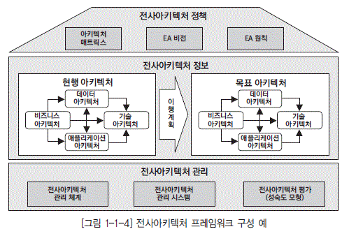
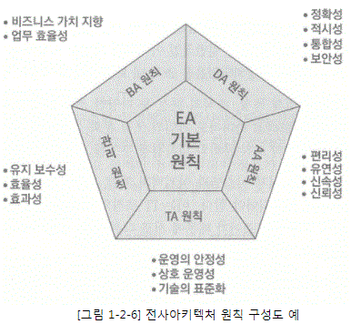
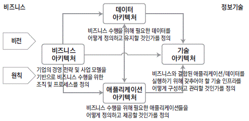

# I. 전사 이키텍처 이해

## 1. 전사 아키택처(EA, Enterprise Architecture) 개념
### 1-1. 전사 이키텍처 정의 
#### 출현 배경
- 오늘날 기업의 비즈니스와 시스템의 복잡도 증대
- 시스템에 대한 전체적인 파악이 어려워지고 변경이 곤란해지고 있음
- 이러한 복잡한 시스템ㅇ르 쉽게 파악할 수 있고, 변화시킬 수 있는 설계도와 같은 것이 필요 

#### 전사 아키텍처란?
- 복잡한 기업의 모습을 다양한 측면에서 분석하고 표현하여 이해하기 쉽도록 정보체계를 구축하고 이를 활용하는 것
- 기업의 목표와 요구를 잘 지원하기 위해 IT 인프라의 각 부분들이 어떻게 구성되고 작동되어야 하는 가를 체계적으로 기술하는 것 
- 조직 및 업무활동과 정보기술 간의 관계를 현재 모습과 향후 추구할 모습을 별도로 정의한 청사진

#### 미국 전자정부 법
- 전사 아키텍처는 **조직의 임무가 정의한 전략적 정보자산**, 그 **임무 수행에 필요한 정보**, 그 **임무 수행에 필요한 기술**, **변화하는 요구에 대응하기 위해 신기술의 구현을 위한 전환과정**으로 구성된다.
- 각 구성요소는 현행 아키텍처, 목표 아키텍처, 전환을 위한 계획을 포함한다. 

#### 국내 EA/ITA 법 
- 정보시스템의 효율적 도입 및 운영에 관환 법률 
- 일정한 기준과 절차에 따라 업무, 응용, 데이터, 기술, 보안 등 조직 전체의 정보화 구성요소들을 통합적으로 분석한 뒤 이들 간의 관계를 구조적으로 정리한 체계 및 이를 바탕으로 정보시스템을 효율적으로 구성하기 위한 방법
- 전사 아키텍처의 활용을 촉진하고 공공기관 등에 정보시스템을 효율적으로 도입 및 운영할 수 있는 기반을 마련하기 위해 전사 아키텍처를 정의하도록 함 

#### 전사 아키텍처 도입 목적
- 기업의 목적을 가장 잘 달성할 수 있는 IT 인프라 구성
- 비즈니스와 IT의 유기적인 연계
- 비즈니스 환경 변화에 대한 신속한 대응
- IT 투자 대비 효과의 최대화
- IT 관리의 효율성 제고 

#### 전사(Enterprise) 정의 
- 공동의 목표를 추구하기 위해 고객과 상품 또는 서비스가 존재하고, 이를 지원하기 위한 조직, 자원, 기술을 보유하며, 필요한 업무 프로세스를 수행하는 조직의 집합체 
- 전사 아키텍처 수립의 대상으로, 일반적으로는 기업 또는 기관을 지칭하지만 항상 일치하지는 않음

#### 아키텍처 정의
- 구성요소의 구조, 구송요소들 사이의 관계, 구성요소의 설계 그리고 시간 경과에 따른 구성요소의 발전을 위한 원리와 지침
- 아키텍처는 대상에 대한 구조뿐만 아니라, 대상 구조의 유지 관리를 위한 원칙과 지침 그리고 향후 목표 아키텍처로 가기 위한 계획을 포함
- 아키텍처의 구성요소 
    - 규칙(Rule)
      - 전략
      - 원칙/지침
      - 표준
    - 모델(Model)
      - 참조모델
      - 비즈니스 아키텍처
      - 데이터 아키텍처
      - 어플리케이션 아키텍처
      - 기술 아키텍처
    - 계획(Plan)
        - 이행 계획
        - 구축 계획
      
#### 전사 아키텍처 추진 현황
- 세계적으로 정부와 민간기업의 IT 혁신을 위한 주된 관심사로서 다양한 산업으로 확산
- 국내의 경우 범정부 차원의 전자정부 과제의 하나로 활발히 추진 중

#### EA(Enterprise Architecture) / ITA(Information Technology Architecture)
- 정보 기술 아키텍처는 1996년 미국 정보기술관리혁신법에서 ITA 라는 용어를 사용했으나, 2000년 OMB A-130 회람에서 아키텍처 관련 이런 개념을 전사 아키텍처라 명명
- 전사 아키텍처는 좀 더 광의의 아키텍처 개념으로, ITA 는 정보기술 중심의 아키텍처 개념으로 불 수 있는데, 국내의 경우 ITA 라는 용어를 먼저 사용하였으나, 현재는 전사 아키텍처로 통합하여 사용하고 있음

#### DAP 역할 (Data Architecture 의 역할 )
- 데이터 아키텍처 전문가는 전사 아키텍처에 대해 정확히 이해하고 있어야 하고, 기업의 전사 아키텍처 추진에 대하여 관심을 가지고, 구축된 전사 아키텍처 정보를 적극 활용해야 함
- 전사 아키텍처 수립 시 DAP 가 데이터 아키텍처 수립에 참여하는 것이 이상적이며, 직잔접적으로라도 지원할 필요가 있음
- DAP 는 항상 전사 아키텍처 개념으로 데이터 아키텍처 업무에 접근하는 것이 바람직 함

### 1-2. 전사 아키텍처 프레임 워크 
#### 전사 아키텍처 프레임 개념
- 전사 아키텍처 활동에 얻어지는 산출물을 분류하고 조직화하고 이를 유지 관리하기 위한 전체적인 틀 
- 전사 아키텍처를 정의하기 위해서는 우선 전사아키텍처 프레임워크를 결정해야 함
- 여러 선진모델이 있고 정부에서도 가이드를 제시하고 있어, 기관이나 기업이 이를 참조가능 

#### 전사 아키텍처 프레임 워크 구성요소 

- EA 정책: 어떤 식으로 전사 아키텍처를 구축하고 관리할 것인지에 대한 방향성 수립 
    - (아키텍처 매트릭스) 전사 아키텍처의 정보를 체계적으로 분류한 틀, 기업이 관리하려고 하는 전사아키텍처 정보의 수준과 활용 계층을 결정 
    - (EA 비전) 전사아키텍처 수립을 통하여 기업이 궁극적으로 달성하고자 하는 모습 
    - (EA 원칙) 전사 아키텍처 정보를 효율적으로 구축하고, 정보를 효과적으로 활용하기 위해서 조직 구성원이 공유해야 할 규범  
      

- EA 정보: 현행 시스템에 대한 현행 아키텍처 -> 이상적인 목표 아키텍처, 그리고 이를 위한 이행계획 
    - (현행 아키텍처) 각 아키텍처 도메인별 기업의 현재 상태를 정의 
    - (목표 아키텍처) 각 아키텍처 도메인별 기업의 궁극적으로 달성하고 자하는 목표 아키텍처의 상태 정의 
    - (이행 계획) 각 아키텍처 도메인별 현재 모습에서 바람직한 모습으로 이행하기 위한 이행 전략과 이행 계획 정의  
      
      - IT의 사명은 비즈니스 체계를 IT 시스템으로 구축하는 것 따라서 먼저 IT 시스템의 베이스 라인인 비즈니스 아키텍처를 먼저 수립  
        기업에 따라 가장 바람직한 비즈니스 모델을 구축 
      - 

- EA 관리: 구축한 아키텍처를 관리 체계
    - (EA 관리 체계)
    - (EA 관리 시스템)
    - (EA 평가)

## 2. 전사 이키텍처 구축

## 3. 전사 이키텍처 관리 및 활용

 

# II. 데이터 요건 분석
## 1. 정보 요구사항 개요

## 2. 정보 요구 사항 조사

## 3. 정보 요구사항 분석

## 4. 정보 요구 검증

 

# III. 데이터 표준화

## 1. 데이터 표준화 개요

## 2. 데이터 표준 수립

## 3. 데이터 표준 관리

 

# IV. 데이터 모델링

## 1. 데이터 모델링 이해

## 2. 개념 데이터 모델링

## 3. 논리 데이터 모델링

## 4. 물리 데이터 모델링