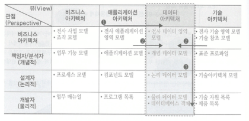

# I. 전사 이키텍처 이해

## 1. 전사 아키택처(EA, Enterprise Architecture) 개념
### 1-1. 전사 이키텍처 정의 
#### 출현 배경
- 오늘날 기업의 비즈니스와 시스템의 복잡도 증대
- 시스템에 대한 전체적인 파악이 어려워지고 변경이 곤란해지고 있음
- 이러한 복잡한 시스템ㅇ르 쉽게 파악할 수 있고, 변화시킬 수 있는 설계도와 같은 것이 필요 

#### 전사 아키텍처란?
- 복잡한 기업의 모습을 다양한 측면에서 분석하고 표현하여 이해하기 쉽도록 정보체계를 구축하고 이를 활용하는 것
- 기업의 목표와 요구를 잘 지원하기 위해 IT 인프라의 각 부분들이 어떻게 구성되고 작동되어야 하는 가를 체계적으로 기술하는 것 
- 조직 및 업무활동과 정보기술 간의 관계를 현재 모습과 향후 추구할 모습을 별도로 정의한 청사진

#### 미국 전자정부 법
- 전사 아키텍처는 **조직의 임무가 정의한 전략적 정보자산**, 그 **임무 수행에 필요한 정보**, 그 **임무 수행에 필요한 기술**, **변화하는 요구에 대응하기 위해 신기술의 구현을 위한 전환과정**으로 구성된다.
- 각 구성요소는 현행 아키텍처, 목표 아키텍처, 전환을 위한 계획을 포함한다. 

#### 국내 EA/ITA 법 
- 정보시스템의 효율적 도입 및 운영에 관환 법률 
- 일정한 기준과 절차에 따라 업무, 응용, 데이터, 기술, 보안 등 조직 전체의 정보화 구성요소들을 통합적으로 분석한 뒤 이들 간의 관계를 구조적으로 정리한 체계 및 이를 바탕으로 정보시스템을 효율적으로 구성하기 위한 방법
- 전사 아키텍처의 활용을 촉진하고 공공기관 등에 정보시스템을 효율적으로 도입 및 운영할 수 있는 기반을 마련하기 위해 전사 아키텍처를 정의하도록 함 

#### 전사 아키텍처 도입 목적
- 기업의 목적을 가장 잘 달성할 수 있는 IT 인프라 구성
- 비즈니스와 IT의 유기적인 연계
- 비즈니스 환경 변화에 대한 신속한 대응
- IT 투자 대비 효과의 최대화
- IT 관리의 효율성 제고 

#### 전사(Enterprise) 정의 
- 공동의 목표를 추구하기 위해 고객과 상품 또는 서비스가 존재하고, 이를 지원하기 위한 조직, 자원, 기술을 보유하며, 필요한 업무 프로세스를 수행하는 조직의 집합체 
- 전사 아키텍처 수립의 대상으로, 일반적으로는 기업 또는 기관을 지칭하지만 항상 일치하지는 않음

#### 아키텍처 정의
- 구성요소의 구조, 구송요소들 사이의 관계, 구성요소의 설계 그리고 시간 경과에 따른 구성요소의 발전을 위한 원리와 지침
- 아키텍처는 대상에 대한 구조뿐만 아니라, 대상 구조의 유지 관리를 위한 원칙과 지침 그리고 향후 목표 아키텍처로 가기 위한 계획을 포함
- 아키텍처의 구성요소   

      
#### 전사 아키텍처 추진 현황
- 세계적으로 정부와 민간기업의 IT 혁신을 위한 주된 관심사로서 다양한 산업으로 확산
- 국내의 경우 범정부 차원의 전자정부 과제의 하나로 활발히 추진 중

#### EA(Enterprise Architecture) / ITA(Information Technology Architecture)
- 정보 기술 아키텍처는 1996년 미국 정보기술관리혁신법에서 ITA 라는 용어를 사용했으나, 2000년 OMB A-130 회람에서 아키텍처 관련 이런 개념을 전사 아키텍처라 명명
- 전사 아키텍처는 좀 더 광의의 아키텍처 개념으로, ITA 는 정보기술 중심의 아키텍처 개념으로 불 수 있는데, 국내의 경우 ITA 라는 용어를 먼저 사용하였으나, 현재는 전사 아키텍처로 통합하여 사용하고 있음

#### DAP 역할 (Data Architecture 의 역할 )
- 데이터 아키텍처 전문가는 전사 아키텍처에 대해 정확히 이해하고 있어야 하고, 기업의 전사 아키텍처 추진에 대하여 관심을 가지고, 구축된 전사 아키텍처 정보를 적극 활용해야 함
- 전사 아키텍처 수립 시 DAP 가 데이터 아키텍처 수립에 참여하는 것이 이상적이며, 직잔접적으로라도 지원할 필요가 있음
- DAP 는 항상 전사 아키텍처 개념으로 데이터 아키텍처 업무에 접근하는 것이 바람직 함

### 1-2. 전사 아키텍처 프레임 워크 
#### 전사 아키텍처 프레임 개념
- 전사 아키텍처 활동에 얻어지는 산출물을 분류하고 조직화하고 이를 유지 관리하기 위한 전체적인 틀 
- 전사 아키텍처를 정의하기 위해서는 우선 전사아키텍처 프레임워크를 결정해야 함
- 여러 선진모델이 있고 정부에서도 가이드를 제시하고 있어, 기관이나 기업이 이를 참조가능 

#### 전사 아키텍처 프레임 워크 구성요소 

- EA 정책: 어떤 식으로 전사 아키텍처를 구축하고 관리할 것인지에 대한 방향성 수립 
    - (아키텍처 매트릭스) 전사 아키텍처의 정보를 체계적으로 분류한 틀, 기업이 관리하려고 하는 전사아키텍처 정보의 수준과 활용 계층을 결정 
    - (EA 비전) 전사아키텍처 수립을 통하여 기업이 궁극적으로 달성하고자 하는 모습 
    - (EA 원칙) 전사 아키텍처 정보를 효율적으로 구축하고, 정보를 효과적으로 활용하기 위해서 조직 구성원이 공유해야 할 규범

- EA 정보: 현행 시스템에 대한 현행 아키텍처 -> 이상적인 목표 아키텍처, 그리고 이를 위한 이행계획 
    - (현행 아키텍처) 각 아키텍처 도메인별 기업의 현재 상태를 정의 
    - (목표 아키텍처) 각 아키텍처 도메인별 기업의 궁극적으로 달성하고 자하는 목표 아키텍처의 상태 정의 
    - (이행 계획) 각 아키텍처 도메인별 현재 모습에서 바람직한 모습으로 이행하기 위한 이행 전략과 이행 계획 정의  
      
      - IT의 사명은 비즈니스 체계를 IT 시스템으로 구축하는 것 따라서 먼저 IT 시스템의 베이스 라인인 비즈니스 아키텍처를 먼저 수립  
        기업에 따라 가장 바람직한 비즈니스 모델 정의
      - 비즈니스를 제대로 수행하기 위한 각종 정보들 데이터를 데이터 아키텍처로 정의
      - 비즈니스 업무 기능들을 정보화 하기 위해서 묶어 놓은 프로그램들의 집합인 어플리케이션 아키텍처를 정의 
      - 데이터 아키텍처(데이터베이스), 어플리케이션 아키텍처(각종 프로그램) 들이 구동될 인프라 환경을 기술 아키텍처에서 정의  

- EA 관리: 구축한 아키텍처를 관리 체계  
  아키텍처 정보는 시시각각 변화한다. 이와 같은 변경을 현재 상황에 맞게 바꿔주는 것을 EA 관리라고 한다.
    - (EA 관리 체계) 전사 아키텍처 '거버넌스' 라고도 하며, 구축된 전사 아키텍처를 유지하고 개선하기 위한 제도적 기반을 수립하는 것   
      조직, 프로세스 포함 
    - (EA 관리 시스템) 전사 아키텍처 정보 관리의 효율성을 제고하고, 전사 아키텍처 정보의 공유를 활성화 하기 위해 구축하는 정보 시스템 
    - (EA 평가) 전사아키텍처의 관리와 활용 수준의 제고를 위해서는 전사 아키텍처에 대한 주기적인 평가, 성숙모형이 필요 

#### 아키텍처 도메인 구성
- 비즈니스 아키텍처
  - 조직의 목적 및 업무를 지원하기 위해 수행하는 업무를 분석하고, 이를 멉무 활동 단위로 분활하여 표현한 아키텍처  
  - 우리가 정보화를 추진하기 위해서는 대상 업무가 있어야 한다. 이와 같은 대상 업무를 명확하게 표현한 것을 비즈니스 아키텍처라고 한다.
  - 우리 기업에서 수행하고 있는 업무를 전사 차원에서 알기 쉽게 표현한 것 
  - 예: 전사 사업 모델(가치사슬), 조직 모델, 업무기능 모델, 프로세스 모델, 업무 메뉴얼

- 어플리케이션 아키텍처
  - 조직의 입무를 수행하는 데 필요한 어플리케이션의 기능 및 이들 간의 관계를 정의한 아키텍처 (각 어플리케이션 간의 인터페이스도 명확하게 규정)
  - 현업 사용자들이 사용하는 시스템 단위 (회계 관리 시스템, 재무회계 시스템 등)
  - 예: 전사 어플리케이션 영역 모델, 에플리케이션 모델, 컴포넌트 모델, 프로그램 목록 

- 데이터 아키텍처
  - 효과적인 업무 처리 및 의사결정을 위해 어떤 정보가 사용되고, 전달되어야 하는지를 표현한 아키텍처 
  - 업무를 수행하기 위해서 필요한 정보(데이터)를 정확히 표현한 것 
  - 예: 전사데이터 영역 모델, 개념 데이터 모델, 논리 데이터 모델, 물리 데이터 모델 

- 기술 아키텍처 
  - 비즈니스, 데이터, 애플리케이션, 아키텍처를 지원하는 데 필요한 정보기술 인프라 요소 및 구조, 그리고 이들 간의 관계를 표현한 아키텍처  
  - 하드웨어와 관련된 부분, 시스템 소프트웨어와 관련된 부분, 네트워크와 관련도니 부분으로 구분 
  - 예: 전사 기술영역 모델, 기술 참조 모델, 표준 프로파일, 기술 아키텍처 모델, 기술지원 목록, 제품 목록 

#### 주요 전사 아키텍처 프레임워크 비교 
- ZEAF
- FEAF
- REAF
- DoDAF
- TOGAF
- 공공부문EAF

### 1-3. 전사 아키텍처 참조 모델

#### 참조 모델(Reference Model) 정의
- 정부 또는 산업, 기업군별로 아키텍처 구성요소를 식별하여 표준화한 것으로 기관이나 기업의 전사 아키텍처 수립 시 참조하는 추상화된 모델   
  
- 전사 아키텍처를 잘 구축하기 위해 외부의 베스트 프렉티스를 잘 참조하는 것 
    - (업무 참조 모델) 각 기관에서 업무를 통합하고 자체 업무 기능 및 타 기관의 업무기능 파악 
    - (서비스 컴포넌트 참조 모델) IT 서비스와 관련되어 있어 많은 기관에서 유사하게 발생할 수 있는 재사용 가능성이 높고 연계성이 높은 서비스 파악 
    - (데이터 참조 모델) 데이터 표준 분류를 어떻게 할 것인지 파악 
    - (기술 참조 모델) 정보 기술 요소들을 기술 인프라 차원에서 파악 
    - (성과 참조 모델) IT 에 대한 투자를 명확하게 파악

#### 참조 모델 사례
- 업무 참조 모델(BRM, Business Reference Model)  
  - 특정 기관에 독립적이고 업무 기능 중심으로 정의한 참조 모델   
  - 조직과 무관한 기능 위주의 접근으로 다른 아키텍처를 정의하는 기준으로도 활용
- 서비스 참조 모델(SRM, Service Reference Model)
  - 업무 수행과 목표 달성을 지원하는 서비스 요소를 분류하기 위한 기느 중심의 참조 모델
  - 범정부 차원의 업무 및 응용 서비스 요소 발견 가능 
  - 응용 서비스의 재활용 촉진
  - 정부기관 업무지원 컴포넌트에 대한 단일화/통합된 분류체계
- 데이터 참조 모델(DRM, Data Reference Model)
  - 기관 간의 공통 정보 파악과 활용을 지원하기 위한 모델
  - 데이터 개괄 모델, 데이터 분류, 데이터 구조, 데이터 교환, 데이터 관리 기준 등 영역으로 구성
- 기술 참조 모델(TRM, Technical Reference Model)
  - 업무와 서비스 구성요소의 전달과 교환, 구축을 지원해주는 기술 표준, 기술 명세, 기술요소를 기술한 것 
- 성과 참조 모델(PRM, Performance Reference Model) 
  - 정보화 성과관리를 위한 구성 요소와 관계를 정의한 것 
  - 정보화 성과 제고 및 정보화 사업 품질 향상을 위한 기본 틀을 제공 
  - 평가 분류 체계, 표준 가시 경로, 성과 관리 표준 양식으로 구성

#### 참조모델의 활용 방안 

### 1-4. 전사 아키텍처 프로세스 
- 전사 아키텍처 프로세스는 전사 아키텍처를 구축하고 관리하는 절차에 관한 것으로 작업의 단계와 공정, 작업내용 등을 정의  
  

## 2. 전사 이키텍처 구축
### 2-1. 전사 아키텍처 방향 수립 
#### 전사 아키텍처 방향 수립 개요 
- 전사 아키텍처 구축의 목표와 목적을 정의하고, 이를 달성하기 위한 전사 아키텍처 프레임워크를 정의하는 것
- 다수의 이해관계자에게 공동의 목표와 목적을 제공함으로써 추진 과정에서 발생할 수 있는 의견충돌을 사전에 방지

#### 작업 공정
> 전사 아키텍처 환경 분석 -> 전사 아키텍처 구축 방향 정의 -> 전사 아키텍처 프레임워크 정의
- 전사 아키텍처 환경 분석 
  - 기업의 외부환경과 내부환경을 분석하고, 관련된 이해관계자로부터 전사아키텍처 수립을 위한 요건 도출
  - 비즈니스 내/외부 환경 분석, IT  내/외부 환경 분석, 엔터프라이즈 범위 정의 
  
- 전사 아키텍처 구축 방향 정의 
  - 전사 아키텍처 환경분석을 바탕으로 아키텍처 구축의 목적과 범위, 비전을 정의 
  - 기업이 전사 아키텍처를 통해 실현하고자 하는 미래의 모습과 이를 확보하기 위해 기업이 공유해야할 가치
  - 목적 및 범위 정의, 전사 아키텍처 비전 수립 
  - (전사 아키텍처 비전) 전사 아키텍처가 제공해야할 가치를 일치시킴으로써, 기업의 방향과 정보화 방향 사이의 연결 고리 구축
    - (핵심 목표) 전사 아키텍처 도입을 통하여 궁극적으로 달성하고자 하는 기업의 목표 또는 실현하고자 하는 모습
    - (핵심 가치) 전사아키텍처의 핵심 목표 달성을 위해 구성원들이 추구하거나 지켜야하는 신념
- 전사 아키텍처 프레임워크 정의
  - 계획단계에서 정의된 전사아키텍처 프레임워크에 대해 기업의 특별한 변경 요구가 있을 경우 이를 반영하고,  
    전사 아키텍처프레임워크에 대하여 관련자들이 공감대를 형성하고 확인 
  - 전사아키텍처 수립을 위해서는 프레임워크 정립이 선행되어야 함
  - 프레임워크 리뷰 및 보완
  - 프레임 워크 구성
    - (ITA 방침) 정책, ITA 전략, 아키텍처 원칙, 요구사항
    - (ITA 활동) 아키텍처 모델, 생명주기(준비, 수립, 활용 관리), 지원 도구(참조모델, 관리시스템, ITA Tool)
    - (ITA 산출물) 아키텍처 산출물, 지원 산출물

### 2-2. 전사 아키텍처 정보 구성 정의 

#### 전사 아키텍처 정보 구성 정의 개요 
- 전사 아키텍처 정보란?
  - 기업을 잘 이해하기 위해 필요한 업무와 정보기술에 대한 정보로서 활용할만한 가치가 있고 관리가 용이한 정보 
  - 업무와 정보기술의 구성요소와 구성요소 간의 관계를 포함하며, 가능한 변화하지 않는 구성요소를 도출하여 정의
  - 개발할 때 많은 산출물이 나오지만 운용할 때 이 모든 산출물을 활용하지는 않음 
    - 업무를 알고 해당 업무에서 필요한 정보를 파악 
    - 업무를 어떻게 묶을 것인지 프로그램 단위로 정의
    - 어플리케이션이 어떤 하드웨어와 소프트웨어 하에서 운용되어야 하는가
  - 운용을 위해서 정말 필요한 정보만이 전사 아키텍처 정보
- 전사 아키텍처 정보구성 정의란
  - 전사 아키텍처 정보를 표현하기 위해서는 전사 아키텍처 산출물과 이를 구성하는 요소를 분류하는 것 
  - 매트릭스 형태로 작성되며, 이를 '아키텍처 매트릭스' 라고 함
  - 쉽게 말해 정보구성은 우리가 관리해야할 전사 아키텍처 정보가 무엇인지 정의하는 것 

#### 정보구성 정의 작업 공정 
> 아키텍처 매트릭스 정의 -> 참조모델 정의 -> 전사 아키텍처 원칙 정의

#### 아키텍처 매트릭스 정의
- 아키텍처 매트릭스는 전사 아키텍처 프레임워크의 핵심 구성요소로 전사를 설명하는 모델정보를 통일된 시각으로 볼 수 있는 논리적 틀
- 아키텍처 매트릭스는 의사결정 유형(관점)과 아키텍처 정보 유형(뷰)의 두 축을 기준으로 2차원 매트릭스 형태
- 작업 내용  
  
- 산출물 예시  
  
- 아키텍처 정보 구성요소 정의: 전사 아키텍처 정보를 공유정보로 구축하기 위해 전사 아키텍처 산출물에 포함된 정보를 중복이 없고 상호관계가 유기적으로 연결되는 구성요소로 정의 (업무, 데이터, 응용, 기술)

#### 아키텍처 매트릭스 정의 고려사항
- 매트릭스를 정의할 때는 일반적인 아키텍처 개념을 포함하면서 조직 내 모든 계층의 사람들이 매트릭스에 포함되는 산출물이 범위와 목적에 적합하게 정의되었음을 확신할 수 있어야 함 
- 조직적, 정치적, 지리적 특성, 조직의 편견 등 다양한 조직의 문화와 의사결정 구조가 반영되어야 함 
- 아키텍처 매트릭스는 실제의 시스템과 아키텍처 개발 표준에 대한 준수성을 높이고 조직별로 통일된 접근이 가능하도록 정의되어야 함
- 각 아키텍처 도메인은 상호 간에 연계성을 가져야 함. 아키텍처에서 정의된 산출물은 상호 연관성을 가지며 비즈니스-데이터-어플리케이션-기술 아키텍처 간에 통합적인 관리가 가능해야 함

#### 참조모델 정의
- 다수 엔터프라이즈를 가지고 있는 기업은 참조모델을 정의하고, 개별 기업은 참조모델을 확인하는 과정
- 정부나 기업군 또는 상위기관은 하위 기관이나 기업에서 참고할 참조모델을 정의하고, 개별 기관이나 기업들은 이런 참조모델을 참고하여 전사 아키텍처 구성 요소의 타당성을 확인
- 참조모델은 업무와 정보기술에 대한 체계적인 분류와 표준화를 통해 정보화의 통합성, 중복개발 방지, 공유정보의 발견, 상호운용성 향상 등의 목적으로 설계되어 있기 때문에, 개별 기관은 상위 기관의 참조모델을 참고하여 아키텍처 정보를 정의하는 것이 바람직함
- 참조모델 정의는 기업이 속한 산업이나 가치사슬 네트워크에 따라 범위가 달라짐
- 기술 참조모델의 경우, 개별 기관이나 기업에서도 기술의 표준화와 기술요소간 상호운용성을 향상하기 위해 정의하여 활용하는 것이 일반적임

#### 전사 아키텍처 원칙 정의 
- 전사 아키텍처 비전 달성을 위해 구성원들이 공통으로 지켜야하는 규범 정의
- 원칙은 목표 달성을 위한 의사결정의 객관적 기준을 제시하여 의사결정을 효과적으로 지원하고, 업무 효조와 조정을 위한 의사소통 과정의 투명성 제고 
- 전사 아키텍처 원칙 구성 예  
  

### 2-3. 전사 아키텍처 정보 구축
#### 전사 아키텍처 정보 구축 개용
- 전사 아키텍처 정부 구성 정의 단계에서 정의된 전사 아키텍처 정보를 실제로 작성하는 과정
  - 아키텍처 매트릭스에서 정의된 산출물에 대해 현행기준과 목표기준의 아키텍처 정보를 각각 작성
  - 전사 아키텍처 수립 프로젝트의 핵심 작업 공정
- 전사 아키텍처 정보 구축은 우선 관련 자료를 수집한 후 현행의 아키텍처를 정의하고, 개선점을 도출하여 목표 아키텍처를 정의

#### 정보 구축 작업 공정 
> 전사 아키텍처 정보 구축 준비 -> 현행 아키텍처 정보 구축 -> 목표 아키텍처 정보 구축

#### 전사 아키텍처 정보 구축 준비
- 전사 아키텍처 자료 수집
  - 기업에 존재하는 아키텍처 정보를 수집하며, 수집해야 할 자료는 정의된 아키텍처 매트릭스에 따라 달라짐
  - 업무에 관련된 것은 업무지침서나 규정 등을 수집하고, 데이터나 어플리케이션에 관련된 것은 정보 시스템 구축 시 작성한 산출물이나 완료보고서 등을 수집하고, 기술 인프라는 시스템 도입 문서와 운영 메뉴얼 등을 수집함
- 전사 아키텍처 정보 구축 방식 비교 
  - 상향식 구축 
    - (방법) 최하위에 있는 구성요소를 조사 분석하여 구성요소들의 공통점을 파악하고 공통적인 구성요소들을 모아 상위 구성요소를 정의해나가는 방식 
    - (장점) 조직 모든 업무가 포함되는 것을 보장할 수 있음
    - (단점) 상위 업무 기능 분류의 수준이 서로 다르게 나타날 수 있음
  - 하향식 구축 
    - (방법) 최상위 구성요소로부터 시작하여 분류 기준에 따라 하위 구성 요소를 도출해내는 방식 
    - (장점) 일반적인 분류기준이나 목적에 따른 분류기준을 따르기 때문에 관점이 명확 
    - (단점) 일부 업무가 누락될 가능성이 있으며 어디에도 포함되지 않는 구성요소가 발생할 수 있음

#### 현행 아키텍처 정보 구축
- 현재 업무나 정보 시스템에 대하여 기존의 자료를 분석하여 전사아키텍처 정보 구축 
- 상위 수준의 업무기능과 시스템에 대한 분류를 우선 수행한 후 그 기준에 따라 나머지 전사 아키텍처 정보를 구축하는 것이 효율적
- 세부 작업 내용 
  - (현행 비즈니스 아키텍처 정의) 전사 사업모델 분석, 조직 모델 분석, 업무기능 모델 정의, 프로세스 모델 정의, 업무메뉴얼 파악 정리
  - (현행 어플리케이션 아키텍처 정의) 전사 어플렠이션 영역 식별, 어플리케이션 모델 정의, 컴포넌트 모델 정의, 프로그램 목록 파악 정리
  - (현행 데이터 아키텍처 정의) 전사 데이터 영역 식별, 개념 데이터 모델 정의, 논리 데이터 모델 정의, 물리 데이터 모델 정의. 데이터베이스 객체 파악 정리
  - (현행 기술 아키텍처 정의) 전사 기술영역 식별, 기술 참조모델 정의, 기술 표준 분석, 기술 아키텍처 요소 식별, 기술자원 목록, 제품목록 파악 정리
- 구성 요소 파악과 진단이 동시에 이루어 지는 것 

#### 목표 아키텍처 정보 구축
- 현행 아키텍처에 대한 문제점과 개선사항을 도출하고, 이를 목표 아키텍처에 반영하는 방식으로 진행 
- 비즈니스 아키텍처를 먼저 정의하고, 이를 효율적으로 지원하는 아키텍처를 정의
- 세부 작업 내용 
  - 목표 비즈니스 아키텍처 정의: 전사 사업모델 정의, 조직 모델 정의, 업무기능 모델 정의, 프로세서 모델 정의, 업무메뉴얼 정보 구축
  - 목표 어플리케이션 아키텍처 정의: 전사 어플리케이션 영역 모델 정의, 어플리케이션 모델 정의, 컴포넌트 모델 정의. 프로그램 목록 정보 구축
  - 목표 데이터 아키텍처 정의: 전사 데이터 영역 모델 정의, 개념 데이터 모델 정의, 논리 데이터 모델 정의, 물리 데이터 모델 정의, 데이터베이스 개체 정보 구축
  - 목표 기술 아키텍처 정의: 전사 기술영역 모델 정의, 기술 참조모델 정의, 표준 프로파일 정의, 기술 아키텍처 모델 정의, 기술자원 목록, 제품 목록 정보 구축

## 3. 전사 이키텍처 관리 및 활용
### 3-1. 전사 아키텍처 관리 체계
#### 전사 아키텍처 관리체계 개요
- 전사 아키텍처 관리체계의 개념 
  - 전사 아키텍처를 유지 관리하기 위한 조직과 프로세스를 정립하는 것 
  - IT 기획에서 서비스 제공이 이르는 모든 과정에서 전사 아키텍처 정보를 활용하여 의사결정이 이루어 짐으로 일관성과 합리성이 증대됨 
  - 아키텍처 정보는 시시각각 변화한다 이 변화에 대응할 수 있는 관리 체계를 만드는 것이 구축 보다 더 중요
- 전사 아키텍처 관리체계 구성 
  - 관리 조직, 관리 프로세스, 관리 인력 
- IT 관리체계(거버넌스) 와 EA 관리체계 (거버넌스)

#### 전사 아키텍처 관리 조직 체계
- 전사아키텍처 관리를 위해 필요한 직무와 직무 간의 관계, 업무분장을 정립하는 것  
  

#### 전사 아키텍처 관리 프로세스 
- 전사 아키텍처를 관리하기 위한 활동으리 정의하는 것 
- 전사 아키텍처 관리 프로세스는 전사 아키텍처 관리 관련 모든 활동을 포함하며, 전체 정보 관리 업무체계와 일관성이 확보되도록 하며,  
  IT 활동의 중심이 전사 아키텍처 기반으로 수행될 수 있도록 해야 함  
  

#### 전사 아키텍처 관리 인력 
- 전사아키텍처 관리를 담당하는 직무별 역량을 정의하고 이를 확보하기 위한 방안을 정의하는 것 
- 전사 아키텍처 관리를 위해 필요한 역략 ㄹ요소를 분류하고, 역량 요소를 직무별로 할당하고, 이러한 역량 요소를 확보하기 위한 교육 계획을 수립하고 역량 수준을 평가할 수 있는 체계 포함 
- EA 정보를 지속적으로 발전시킬 수 있는 영역별 아키텍트 지정 필요

#### 효과적인 전사 아키텍처 관리체계 구축을 위한 고려사항
- 정의된 전사 아키텍처 조직체계, 프로세스체계 등을 문서화하여 전 조직이 준수할 수 있도록 제도화 
- 전사 아키텍처 관련 제반 이해당사자의 전사 아키텍처 인지도 향상 및 업무수행 시 전사아키텍처 정보 활용도 증진을 위한 적절한 교육 프로그램 제공
- 전사 아키텍처 관리체계를 주기적으로 점검하여 개선점을 도출하고 반영할 수 있는 제도적 장치 마련
- 전사 아키텍처 관리 시스템 활용도와 만족도를 주기적으로 점검하여 시스템의 품질을 지속적으로 개선

### 3-2. 전사 아키텍처 관리 시스템 
#### 전사 아키텍처 관리 시스템 개념
- 전사 아키텍처 관리 시스템은 전사 아키텍처 정보를 구축하여 관리하고 활용하는 모든 전사 아키텍처 업무 프로세스에 대한 효율성 제고를 지원하기 위한 정보 시스템
- 전사 아키텍처 관리 시스템 구성
  - (정보정의 영역) 전사 아키텍처 정보를 도형으로 표현하는 모델링 도구 등 
  - (정보관리 영역) 전사 아키텍처 정보를 저장 관리하는 전사 아키텍처 레파지토리와 전사아키텍처 정보를 활용하는 전사 아키텍처 포탈로 구성
  - (정보활용 영역) 전사 아키텍처 정보 활용하는 전문 도구 등의 사용자 환경

#### 전사 아키텍처 관리시스템 구성도 예  
  

#### 전사 아키텍처 관리시스템 도입 효과
- 아키텍처 정보를 공유할 수 있어 해당 조직의 각 아키텍처 요소에 대해 이해관계자들이 정확하게 파악할 수 있음 
  - 각 아키텍처별 최산 정보를 아키텍처 담당자의 관점에 맞게 정보 제공 
- 의사소통 도구로 전사 아키텍처 관리 시스템을 활용할 수 있음
  - 현업과 IT 가 공유할 수 있게 하여 의사소통의 오류를 줄임
  - 아키텍처별 요소간의 연관관계를 파악하여 관련 업무조직과 사전에 협의하여 문제를 사전에 인식함으로써 관련자들의 만족도를 높일 수 있음 
- 전사 아키텍처 관리시스템을 의사결정 도구로 활용할 수 있음
  - 업무와 IT 서비스간의 차이 분석 가능 
  - 현행 아키텍처와 목표 아키텍처 간의 차이 분석 가능 

### 3-3. 전사 아키텍처 활용 
#### 전사 아키텍처 활용 개요 
- 전사 아키텍처의 활용이 활성화 되기 위해서는 실제 전사 아키텍처 정보가 IT 관리 업무에 실질적으로 활용될 수 있도록 해야함
- 근시안적인 IT 투자나 중복개발의 방지, 시스템간의 상호운용성 제고, 비즈니스와 정보기술의 변화에 대응력 제고 등에 활용될 수 있음
- 전사 아키텍처의 활용 영역
  - 목표 아키텍처 이행 계획 수립
    - 전사 아키텍처 수립 후 목표 아키텍처를 달성하기 위한 이행계획을 수립하고 그에 따라서 프로젝트를 추진하는 것 
    - 주로 신시스템 추진을 목적으로 전사 아키텍처를 수립하는 경우에 해당 
  - 전사 아키텍처 정보 상시 활용
    - 전사 아키텍처 정보를 활용하여 일상의 IT 업무를 지원하는 것 
    - 전사 아키텍처 정립을 통해 기업의 전반적인 IT 관리 수준을 증대하고자 하는 경우에 해당 

#### 목표 아키텍처 이행 계획 
- 현행 아키텍처에서 목표 아키텍처로의 이행을 위한 전략을 수립하고 구체적인 이행 계획을 수립하는 것 
- 현행 아키텍처와 목표 아키텍처의 차이분석을 통하여 프로젝트를 정의하고, 정의된 프로젝트들 간의 유사성과 상호 연관성을 고려하여 우선순위를 결정하고 이를 위한 이행전략과 세부 이행 계획을 수립
- 목표 아키텍처 이행계획의 주요 활동 
  - (아키텍처 Gap 분석) 목표 및 현행 아키텍처 검토, 차이분석
  - (프로젝트 정의) 프로젝트 목록 정의, 개별 프로젝트 별 필요 리소스 정의, 프로젝트 우선ㅅ누위 및 연관성 분석 
  - (이행전략 수립) 프로젝트 이행에 필요한 단계별 이행전략 대안 수립, 이행전략 별 타당성 분석 및 대안 확정 
  - (이행계획 수립) 프로젝트 별 추진방법 정의, 프로젝트 별 상세 일정계획 수립 
  - (변화관리 계획 수립) 변화관리대상 및 변화요인 식별, 변화관리계획 수립, 변화관리 교육계획 및 자료 작성

#### 전사 아키텍처 정보 상시 활용 
- 기업이 전사 아키텍처 정보를 구축하여 IT 업무 전반에 일상적으로 활용하는 것 
- 이를 위해서는 전사 아키텍처 정보체계의 지속적인 개선 체계와 전사 아키텍처 관리 시스템의 구축이 선행되어야 함 
- 활용 유형별 내용 
   - IT 기획 관리 
     - (업무 프로세스 혁신) 비즈니스 변화와 정보기술 변화에 따르는 영향을 분석하여 대응하고, 조직 간의 업무 수행 범위 및 중복성 확인으로 업무 프로세스 개선 가능
     - (정보화 계획 수립) 정보화 전략 계획 수립 시 활용할 수 있으며, 중복을 배제한 효과적인 시스템 투자계획 수립에 활용
   - IT 구축 관리) 
     - (프로젝트 계획) 정보 시스템 구축을 위한 구체적인 프로젝트 계획 수립 및 제안 요청서 작성 시 활용 
     - (시스템 개발) 기존 시스템 개선 및 신규시스템 개발을 위한 기준 및 참조 정보를 제공하며, 시스템 간 연계성 및 재사용 대상을 식별할 수 있음 
   - IT 운영 및 통제
     - (시스템 운영) 시스템 장애 시 전체 모습을 쉽게 파악할 수 있어 문제점을 신속하게 찾아 낼 수 있으며, 시스템 변경 영향도 파악할 수 있어 위험 최소화 가능 
     - (IT 통제) 도입되는 시스템이 전사 표준을 준수하는 지 통제함으로써 상호운용성, 유지보수 편리성 등을 확보함

#### 전사 아키텍처 도입의 의미
- 전사 아키텍처 도입은 정보화에 대한 일시적이고 단편적인 개선이 아니라, 보다 정확한 정보를 바탕으로 통합되고 일관성 있게 정보화를 계획하고, 실행하고, 검증 및 평가하는 체계를 갖추는 것이다.

#### 전사 아키텍처 정보의 효과적인 활용을 위한 전제 조건 
- 전사 아키텍처 정보 자체의 품질이 보장되어야 함   
- 현행 및 목표 시스템 상황의 아키텍처 정보에 항상 최신의 상태로 정확히 반영되어야 함 
- 전사 아키텍처 정보를 관리하고 적용을 통제할 수 있는 전담 조직이 구성되고 운영되어야 함
- 이 조직은 전사 아키텍처 정보에 품질과 활용도 제고를 책임지며, 필요시 전사 아키텍처 정보의 근거자료를 제시할 수 있어야 함
- 전사 아키텍처 정보를 전사적으로 공유하고 활용할 수 있는 절차와 시스템 필요

#### 전사 아키텍처와 DAP 영역
- 데이터 아키텍처 전문가의 영역은 데이터 아키텍처 전반에 관한 것으로, 광의의 데이터 아키텍처 영역과 일치함
- 광의의 데이터 아키텍처 영역은 DA 원칙, DA 정보, DA 관리 등을 포함
- 광의의 데이터 아키텍처 프레임워크 예  
  
- 데이터 아키텍처가 의미 있기 위해서는 아키텍처 통합성이 이루어져야 함 (불일치성 제거?)
- 아키텍처 통합성의 3가지 유형  
  
 - (범위 통합) 전사 아키텍처 범위 전체에 대한 각 모델 내의 불이치성 제거
 - (수평 통합) 관련된 타 영역과의 불일치성을 제거 
 - (수직 통합) 상위 아키텍처와 하위 아키텍처 간의 불일치성 제거

 

# II. 데이터 요건 분석
## 1. 정보 요구사항 개요
### 1-1. 정보 요구사항 
#### 정의
- 정보 요구사항이란 사용자가 일상적으로 수행하는 업무의 개선 사항이나, 신규 개발사항 등을 시스템을 통해 기능상의 목적을 당서하기 위해 요청하는 내용 임
- 현행 시스템 분석, 사용자 요구 사항 수집, 제안 요청서, 사업 수행 계획서 등을 이용하여 수집 가능 함 
- 사용자의 정보 요구 사항을 정해진 일정과 비용 범위 내에서 사용자가 원하는 시스템으로 개발하기 까지는 많은 어려움이 존재 함
  - 불완전하고 애매모호하게 정의된 정보 요구 사항 
  - 현실성을 배제한 이상적인 정보 요구 사항 
  - 특정 사용자만을 위한 정보요구 사항
- 잘못 분석되고 설계된 정보로 시스템을 개발한다면 사용자 요구사항을 만족하지 못하는 시스템이 되고, 이는 프로젝트 위험과 추가적인 비용을 지불하게 됨

#### 정보 요구사항의 중요성 
- 2004년 Standish Group 조사 결과에 의하면 전체 프로젝트의 29%만이 계획된 예산 내에서 납기를 준수하고, 원하는 기능과 요구사항을 달성했음
- 프로젝트의 18%는 완료 전 또는 사용해 보기도 전에 취소되고, 53%는 납기가 지연 되거나 예산이 늘어나거나 기능, 품질에 문제가 있다고 보고함
- 다양화된 사용자 정보요구 사항과 더욱 복잡해진 정보시스템의 현행을 정확하게 분석하고 이해할 수 있는 능력이 데이터 아키텍처 전문가에게 필요함

#### 정보 요구사항 생명주기 모형 

- 반복적으로 수행하여 사용자 정보 요구사항이 누락 없이 반영되어야 함 
  - (정보 요구사항 수집) 사용자의 정보 요구 사항을 수집하는 단계 
  - (정보 요구사항 분석 및 정의) 수집된 정보 요구 사항을 정리하고 기법을 이용하여 요구 사항을 정의하는 단계
  - (정보 요구사항 상세화) 정보 시스템 관점에서 요구 사항에 대하여 상세하게 분석하는 단계
  - (정보 요구사항 검정으로 구성) 비즈니스, 조직, 애플리케이션 관점에서 검증하는 단계

#### 정보 요구사항 유형

#### 정의 및 관리 목적 
- 정보 요구사항을 비롯하여 관련 애플리케이션 및 시스템 전반에 걸친 사용자의 요구를 수집하고 분류하여 반영하는 작업 절차 
- 정보 요구사항을 종합적으로 검토, 확인함으로써 요건에 맞는 정보시스템을 개발하여 사용자의 만족도를 높이고자 함
- 정보 요구사항 관리는 데이터, 애플리케이션, 비즈니스 등의 요구사항을 전부 포함하는 통합 관리 프로세스로 정립함

#### 정보 요구사항 관리 프로세스

- 요구사항 발송: 사용자가 정보시스템을 활용하면서 발생하는 불편사항이나 신규 개발사항 등의 요건을 정보 요구 사항 정의서 양식에 기록하여 발송 

#### 정보 요구사항 정의서

#### 수행 조직 및 수행 업무
| 역할               | 담당업무                                                                                                                                                                                               |
|------------------|----------------------------------------------------------------------------------------------------------------------------------------------------------------------------------------------------|
| 사용자              | - 변경 요청 - 변경 여부 확인  - 미결 사항에 대한 의사 결정 실시                                                                                                                                                   |
| 담당자              | - 사용자 정보 요구사항 접수  - 사용자 정보 요구사항에 대한 기본적인 검토 - 반영 여부 결정을 위한 사용좌와 1차 미팅 - 접수 요건에 대한 처리 방식 및 처리 기한 결정 - 관련부서별 담당자 수집 및 요건 협의 주도 - 사용자 정보 요구사항 반영 - 테스트 및 검증 - 사용자 반영 결과 통보 |
| 데이터아키텍처  전문가 | - 사용자 정보 요구사항에 대한 표준/데이터베이스/애플리케이션 차원에 대한 영향도 분석 및 보고 - 접수된 요구 사항에 대한 표준 준수 여부 체크 - 영향도 분석을 통한 수정 및 변경 계획 수립 - 표준 제시 및 준수 여부 검토                                                        |

## 2. 정보 요구 사항 조사
### 2-1. 정보 요구사항 수집
#### 관련 문서 수집
- 문서 수집 목적: 구현 시스템의 대상과 범위를 보다 명확하게 정의하고, 기업과 업종에 대한 충분한 이해 
- 문서 수집 자료
  - (경영 계획에 대한 자료) - (중장기 경영전략, 향후 3년에 대한 경영 계획서)
  - (전산 시스템에 대한 자료) - (현행 발행 보고서, 전산 처리 의뢰서)
  - (과거 수행한 컨설팅 보고서)
  - (전산 처리 업무 매뉴얼) 
  - (현업 부서 업무 자료) - (실무 교육 자료)
- 문서 수집 원칙 
  - 기존에 보유하고 있는 문서를 변형하지 않고 수집, 전산 시스템에 대한 자료는 별도의 정리 양식을 이용하여 작성
  - 수집된 문서를 바탕으로 경영 및 정보시스템 현황에 대한 요약표를 작성 
  - 수집된 문서들은 계획수립 기간 문서 관리자를 지정하여 운영
  - 활용을 위하여 문서 분류 방식을 결정한 후, 일정한 장소에 보관
  - 개인별로 보관하는 것을 통제하고, 문서보안 관리에 주의

#### 사용자 면담 
- 면담은 분석가가 특정 고나점에서의 업무요건이나 업무절차를 조사하기 위하여 일반적으로 한 명(혹은 두 명)의 실무자와 대면하여 질의와 응답을 통해 정보를 수집하는 방법
- 프로세스와 프로시저에 대한 이해를 얻기 위한 준비 단계, 또는 워크숍 진행을 돕기 위한 준비 단계에서 유용함 
- 실무자와의 개별적인 면담은 워크숍보다 훨씬 융통싱이 있으며 진행 측면에 있어서도 유연한 진행이 가능함 
- 참여자에게 적은 시간을 할당함으로써 일정 수립이 용이함
- 누락된 부분이 발견되었을 때 추가적인 면담의 계획 및 준비가 쉽게 이루어질 수 있음

-  사용자 면담 진행 
  - 사용자로부터 중요한 업무 내용을 수집 
    - 사용자들로 하여금 시스템 개발에 대한 관심과 신임을 고조시킴
    - 전문가와 대화를 통해서 필요한 정보를 수집  
    - 사용자 면담 절차  
      
    - 계획 및 준비
      - 면담 주제 선정
      - 면담 진행 팀 구성 
      - 면담 대상자 선정
      - 면담 일정 수립
      - 면담 준비
    - 면담 수행 
      - 면담 시작
      - 면담 주체 토의
    - 면담 결과 분석
    - 분석 결과 피드백 
######
- **계획 및 준비**
  - (면담 주제 선정)
    - 면담 주제는 수행 대상 작업과 면담 대상자의 책임 수준에 따라 결정함
    - 면담 대상자 및 대상 작업별로 면담 주제에 따라 면담요지를 작성 
    - 면담 요지를 통하여 면담 대상자는 적절한 답변을 미리 준비할 수 있고, 상상에 의한 답변을 최소화할 수 있으며, 면담 시간도 절약할 수 있음
    - 질문 항목은 면담을 통해 얻고자 하는 것이 무엇인지를 명확하게 하여 선정하며, 면담 대상자가 이해하기 쉽고 질문 항목에 따라 자유로운 의사개진을 할 수 있도록 구성
    - 면담 요지는 면담 개시 1주일 전에 미리 면담 대상자에게 배포하여 면담 대상자가 답변 내용이나 고나련 자료 등을 미리 준비할 수 있도록 함

    - 공통
      - 명담의 취지, 목적, 수행방법, 시간 등
      - 프로젝트의 개요: 목표, 범위, 기간, 조직
    - 현업 부서용 면담 요지
      - 업무의 향후 수행 방향에 대한 의견
      - 면담 대상자가 소속된 부서의 업무 현황 및 개선 요구 사항
      - 현재 사용하는 정보시스템에 관한 의견
      - 프로젝트에 관한 의견: 요구사항, 프로젝트 참여 방안 등
    - 전산 부서용 면담 요지
      - 기획 분야 현황 및 계획: 전산 부서 조직 및 인력, 계획, 문제점, 과제 등 
      - 시스템분야 현호아 및 계획: 조직 및 인력, 시스템 구성, 네트워크 구성, 시스템 운영 절차, 향후 계획, 문제점 및 과제 등
      - 애플리케이션분야 현황 및 계획: 조직 및 인력, 애플리케이션 구성, 데이터베이스 구성, 진행중인 개발 업무, 개발 및 유지보수 계획, 문제점 및 과제 등 

  - (면담 진행 팀의 구성)
    - 각 면담진행 팀은 2명 이상의 프로젝트팀 구성원으로 구성 
    - 한 명은 면담자로서 면담을 주도적으로 진행하고, 다른 한 명은 기록자로서 면담내용을 면담 대상자가 말한 그대로 상세하게 기록
    - 면담자
      - 면담을 진행한다.
      - 면담의 취지를 설명하고 면담 대상자에게 질문한다.
    - 기록자
      - 면담 대상자의 답변 내용을 기록한다. (내용을 요약하지 말고 표현 그대로 기록해야 한다.)
      - 면담 대상자의 답변 내용을 충분히 이해하고 기록하기 위하여 면담 대상업무에 대한 사전 지식이 있어야 한다.
      - 면담 종료 시에 기록내용 중 주요사항(수치, 업무분장 및 책임소재 조직 등에 대한 내용)에 대하여 확인한다.
    - 관찰자
      - 면담이 수행 의도대로 진행되고 있는가를 관찰한다.
      - 면담이 주제의 범위를 벗어나는 경우, 주의를 환기시킨다.
      - 면담자가 놓지는 부분에 대하여 보충질문을 한다.
      - 최종적으로 면담의 종료에 대해 판단한다.

  - (면담 대상자 선정) 
    - 수행 작업에 따라 면담 대상을 선정
    - 면담 대상자는 업무에 대한 명확한 이해를 가능하게 해줄 수 있는 사람 선정 
    - 적절한 대상을 선택하기 위하여 전체 조직 구성도와 프로젝트 범위를 검토하고, 프로젝트 후원자나 사용자측으로부터 추천을 받음
    - 선정된 대상자의 전문 분야와 책임 분야에는 프로젝트의 범위가 포함되어야 함
    - 여러 명의 사용자나 조직들이 유사한 업무를 수행하고 있는 경우 차이점 파악을 위하여 해당 업무에 대하여 적어도 두 명 이상의 면담대상자를 선정(동일한 업무를 수행하더라도 정보화에 대한 의견은 다를 수 있기 때문)

  - (면담 일정 수립) 
    - 선정된 면담 대상자들에게 프로젝트의 목적과 범위를 통보 
    - 면담은 초기단계에서 일정(전체일정)이 정해져 있어야 하며, 면담 개시 최소 1주일 전에 면담 대상자별로 세부일정을 확정함. 또한 가능하면 하향식(상위 관리자나 경영층으로부터 현장실무자 순)으로 일정을 수립
    - 면담 시간은 1.5시간(상위 관리자)에서 3시간(실무자)을 초과하지 않도록 하며, 필요 시 집단 면담을 수행할 수도 있음. 또한 하루에 3회 이상의 면담은 진행하지 않도록 함

  - (면담 준비) 
    - 면담 수행 전에 모든 이용 가능한 자료를 활용하여 면담 대상자가 담당하는 업무활동을 검토. 또한 면담 대상자의 신상명세, 경력, 개인적 성향, 역할, 기능, 경력 등에 대해서도 파악해둠
    - 면담 시나리오를 준비 함. 면담 시나리오는 면담 대상자에게 설명할 프로젝트의 목적과 범위, 면담자 소개, 면담 진행 요령, 면담 종료 시 수칙 등이 포함
    - 면담 시나리오는 면담 대상자에게 배포하지는 않음 
    - 면담 수행 전에 상세한 면담 주제 목록을 중간 관리자와 실무 관리자에게 배포하여 면담 진행자들을 미리 소개하고, 사용 가능한 관련 문서 자료도 함께 요청
    - 면담 진행 순서 준비 
    - 면담 수행 직전 30분 동안에는 수행될 면담에 관한 최종 준비 상황을 확인 
    - 면담 장소는 별도의 프로젝트 면담 장소와 같이, 업무나 기타 요인으로부터 방해를 피할 수 있는 장소가 좋음

  - (면담 시작)
    - 면담 시작 30분 전 필요한 정보 요구와 진행 순서를 점검 
    - 면담 진행 팀원들 각자의 역할 호가인 
    - 면담은 정시에 시작하도록 함 
    - 면담 대상자에게 면담 진행 팀을 소개하고, 프로젝트의 목적, 범위, 일정 등을 먼저 설명한 후, 면담의 목적과 주요 질문 및 진행방식, 예정시간, 면담진행팀원 들의 역할을 설명 함
    - 또한 질문에 대하여 현상, 계획, 바람직한 상황 등을 구분하여 대답해 줄 것을 당부하고, 필요한 경우 면담 주제나 질문사항을 수정
    - 면담은 복수의 팀에서 수행될 수 있으므로, 면담 진행 팀들 간의 수행 방식을 통일하기 위하여 모든 절차가 면담 지침에 세세한 문구까지 모두 반영되어야 함

- **면담 수행** 
  - (면담 주제 토의)
    - 면담자는 준비된 면담요지에 따라 면담을 진행하고, 면담 내용은 모두 면담 기록지에 기록 
    - 질문 시에는 개방적 질문을 사용하며, 면담 주제나 질문지의 순서와 범위를 벗어나지 않도록 노력하고 대화의 흐름이 끊기지 않도록 주의 
    - 면담 대상자의 답변에 대한 가정은 하지 않으며, 진행 도중에 간간이 수집된 정보나 진행 순서 등을 확인 
    - 기록자는 토의된 내용을 가능한 한 모두 기록하며, 추가적인 내용의 기록을 위하여 충분한 여백을 두고, 논의한 말을 기대로 기록
    - 모든 면담 결과의 후속 분석 작업을 위한 공통의 기준으로 사용될 수 있는 표준 기록 양식이 있어야 하며, 면담에서 제기되는 이슈는 면담자와 기록자 모두 기록 
    - 토의가 진행되는 동안, 면담 대상자의 주 책임 업무를 명확히 정의하고 면담 대상자의 각 업무가 시간과 같은 논리적인 순서에 따라 진행되는지 확인

- **면담 결과 분석**
  - 면담 진행 팀은 기록된 내용을 가지고 면담이 종료된 후 면담 진행 팀 전원이 참석하여 주요 이슈를 정리하는 것이 바람직함
  - 기존의 업무 모델을 틀로서 사용할 수 있으나 현재 업무와의 차이점에 주의하고, 가능하면 면담 대상자의 업무 용어를 사용함
  - 면담 대상자가 수행하는 업무활동과 각 업무활동의 수행 목적, 생성 정보, 필요 정보 등을 구분하여 정리함
  - 분석된 면담결과 중 중요도가 큰 사안에 대해서는 별도의 시간을 할애하여 프로젝트 팀원이 상세하게 분석하도록 함

- **분석 결과 피드백** 
  - 분석 정리한 면담 내용에 대해서는 면담 대상자의 확인을 받도록 함
  - 면담 대상자가 면담 결과에 대하여 상반된 의견을 제시하는 경우가 있으므로, 본인에게 승인을 받는 것은 매우 중요함 
  - 면담 대상자가 수정사항을 제시하는 경우 추가적으로 기입함 
  - 시간상 피드백이 곤란한 경우 설명회를 할 수 있음. 부서 간의 이해관계에 따라 이견이 발생할 수도 있으므로 사전 조정 작업이 필요함

- **면담 수행 시 고려 사항** 
  - 면담 시간 준수
  - 비밀 보장
  - 기대 수준 설정
  - 면담 범위 준수
  - 적절한 대상자 선정
  - 응답 유도
  - 면담 내용 문서화
  - 잘못된 선입견의 배제

- **전형적인 질문의 예**
  - 귀하의 업무 영역 중에서 업무활동의 중요한 유형을 말씀하여 주십시오.
  - 이 업무활동이 종료되면 무슨 일이 일어납니까? 또 그 다음에는 무슨 일이 일어납니까? 일반적 결과는 무엇입니까? 어떤 것이 잘못될 수 있습니까? 잘못되면 어떻게 조치합니까? 
  - 이 업무는 다른 방식으로 수행할 수 있습니까?
  - 업무에 필요한 정보에는 어떤 것들이 있습니까? 이들 정보로 무엇을 합니까? 적당한 상세화 수준은 어느 정도 입니까?
  - 어떤 의사 결정이 이루어집니까? 의사결정시 필요한 정보는 무엇입니까?
  - 어던 정보들에 관심이 있습니까?
  - 정확히 이것은 무엇입니까? 그것들을 무엇이라고 부릅니까?
  - 초기와 말기에 어떤 정보들을 보관하면 됩니까? (예: 업무지원자나 퇴직자를 한 종업원으로서 비교)
  - 이것은 얼마나 많이 있습니까? 얼마나 자주 발생합니까? 그것들을 어디서 찾을 수 있습니까? 어디서 발생합니까?
  - 이런 특징을 여러 개 가질 수 있습니까?
  - 이들과 관련된 것을 항상 보관하여야 합니까?
  - 만일 한 직원이 많은 업무를 수행할 수 있으며, 한 업무를 많은 직원들이 수행한다면, 한쪽을 다른 쪽에 어떻게 할당하는가에 관한 상세한 정보를 보관할 필요가 있습니까?

#### 워크숍
- **워크숍 개요 및 목적** 
  - 전문 진행자의 진행 아래 프로젝트의 현업 무서 특과 전산 부서 측의 주요 구성원들이 합께 참여하는 회의 
  - 정치적이거나 개인적인 요소들의 영향을 피하고, 다양한 정보의 원천으로부터 정보의 빠른 추출이나 공유를 요하는 경우, 단순한 회의나 토론 이상의 것을 요구하는 상황 등에 사용될 수 있음 
  - 서로 관련 있는 부서들을 대상으로 워크숍을 실시할 수 있도록 함 
  - 주요 목적 3가지
    - 경영층 또는 현업 부서장의 공통된 의견을 도출 
    - 유사한 업무 또는 관련된 업무 등을 수행하는 부서에 대한 면담에 드는노력을 절감 
    - 전문가들의 판단력을 이용하여 최적의 결론을 도출
  
- **워크숍 준비**
  - 워크숍 과제선정과 계획수립
  - 참가대상자 선정
  - 참가대상장 에게 대한 사전 브맆이 및 교육훈련
  - 킥오프모임 수행
  - 워크숍 자료준비
  - 설비와 물품준비
  - 워크숍 장소선정
  - 워크숍 기간선정 프로그램 준비

- **워크숍 수행** 
  - (워크숍 개시)
    - 워크숍의 시작을 알리고 간략한 인사말을 함
    - 부수적인 항목들(휴게실 위치, 흡연구역 등)에 대해서 공지
  - (워크숍 수행 준비)
    - 워크숍의 목적과 접근방법의 개요를 설명
    - 사용자로 하여금 워크숍의 목적을 재확인하게 함 
    - 워크숍 기간 동안 작업을 수행하기 위하여 필요한 기법들을 습득함
  - (워크숍 수행)
    - 구체적인 워크숍 수행 방식은 형태나 특정 목적에 따라 다르게 수행함
    - 워크숍의 목적에 맞게 진행될 수 있도록 조정하고 관찰함
  - (워크숍 종료)
    - 종료할 때는 진행일정을 확인하고 진행사항을 요약
    - 워크숍 과정에서 도출된 요구사항 들을 공유할 수 있도록 요약하고, 책임자가 전체엑 공유하여 1차적으로 검토 받을수 있도록 함

#### 현행 업무 조사서
- 전체 부서에 대하여 동일한 기준으로 조사하는 것을 원칙으로 함 
- 각 지점이나 부서마다 다르게 업무를 수행하는 경우가 발생할 수 있고, 회사 전체의 업무 수행 빈도와 데이터 수발량을 조사하기 위해서는 전수조사가 필요함
- 동일한 업무를 수행하는 부서 혹은 지점이 여러 개인 경우에는 표본추출 또는 발췌조사로 진행 
- 양식은 단순하고 이해하기 쉬워야 하며, 양식의 작성방법과 작성된 샘플을 첨부하여 배포하는 것이 효과적임
- 내용이 불충분한 경우가 발견되므로, 업무조사서를 1차 수거한 후에 반송하여 다시 작성하는 경우가 발생할 수 있음. 이러한 상황도 일정계획 수립에 반영 
- 사용자가 처리하고 있는 업무기능 들을 정리된 양식으로 기록하여 향후 작업에 도움이 되도록 함

#### 현행 프로그램/데이터 관련 문서
- 향후 사용자 요구사항을 보다 세부적으로 진행하기 위한 사전단계로서 반영되어야 할 현행 시스템의 업무요건을 빠짐없이 파악하기 위한 작업임
- 현행 시스템 프로세스(프로그램)의 구조는 프로세스 계층도와 유사하게 계층적 구조로 표현하며, 이러한 현행 시스템 프로세스(프로그램) 계층도는 향후에 업무모델의 완전성을 검증하기 위한 비교자료로 활용됨
- 현행 시스템의 데이터에 대한 분석은 현행 시스템에서 사용되는 현행 데이터 저장소의 구조를 파악함으로써 현행의 업무 프로세스에서 사용되는 데이터의 구조를 이해할 수 있음 
- 현행 데이터 저장소의 구조는 현행 시스템 데이터 목록 및 세부 내역을 분석함으로써 현행 데이터에 대한 업무 요건 및 업무 규칙, 현행 데이터 저장소의 구조와 화면, 양식, 보고서 레이아웃 등을 이해할 수 있음

#### 사용자 면담 정리 
- 사용자 면담 시 제공된 자료의 샘플이나 고나련 ㅁ누서를 체계적으로 정리 기록 
- 정리가 완료되면 주요한 관점(업무흐름, 수치, 주관부서, 책임부서 등)의 내용에 대해서는 다시 한 번 기록도니 부분의 오류가 있는지 사용자에게 확인을 받도록 함  
  

#### 업무 조자서 정리
- 회사차원에서 활용하는 업무문서 및 팀에서 사용하는 업무문서를 포함하여 전체 리스트를 파악할 수 있도록 체계적인 양식으로 정리함

| 모 델                   | 정 리 항 목                                                         |
|-----------------------|-----------------------------------------------------------------|
| 수행중인 프로세스 목록          | - 대/중/소 분류별 프로세스명 - 프로세스 설명 및 수행 빈도 - 전산화 정도 / 전산화 필요성  |
| 프로세스의 업무 흐름           | - 정보 시스템을 포함하여 관련 부서 간의 업무흐름을 시스템 흐름도 형태로 도식화                   |
| 타 부서 또는 외부기관 으로부터 받는 문서 | - 문서명 및 설명 - 접수 부서(기관) - 접수주기, 접수수단 - 활용 형태 / 단위 문서량 |
| 사용중인 시스템              | - 시스템 명 - 사용 범위, 사용 방법, 사용 빈도 - 유용성 - 편리성           |

#### 워크숍 정리
- 사용자 워크숍을 통해 도출된 요구사항이나 해결 과제들은 명백하고 간결한 문장으로 정리한 후 사후 대처할 수 있도록 함
- 해결 과제에 대해서는 별도의 ID를 부여하여 관리함 
- 워크숍 결과 정리 시에는 다음 사항을 포함함 
  - 워크숍의 목적 / 워크숍 진행 내용
  - 해결 과제에 대한 상태 / 기타 특이사항

  

#### 정보 요구 우선순위 분석
- 화폐가치 산출 방법 
  - 최종적으로 구해진 가치가 높을수록 우선순위가 있음. 그러나 최종 순위는 산출된 수치에 의존하지 않고 고유의 상황에 따라 다르게 적용될 수 있음
  - 정보 요구 사항을 전부 나열 
  - 각각의 정보 요구 사항에 대하여 기업 차원의 중요성을 평가하여 1점부터 3점까지의 점수를 부여
  - 각각의 정보 요구 사항에 대하여 시스템 차원의 중요성을 평가하여 1점부터 3점까지의 점수를 부여
  - 각각의 정보 요구 사항에 대하여 다른 정보 요구사항에 대해 얼마나 도움을 주는가를 평가하여 1점부터 5점까지 점수를 부여 
  - 앞서 부여한 세 가지 점수를 모두 곱함 
  - 전체 정보 요구사항에 대하여 앞서 계산된 점수를 더하고, 점수합계를 100으로 하여 각각의 정보 요구사항 가치를 퍼센트로 환산
  - 회사 전체의 이익에 앞에서 구한 퍼센트를 곱하여 각각의 정보 요구 사항 가치를 금액으로 환산  
  
  
- 상대적 중요도 산정 방법
  - 정보 요구사항이 업무에 기여하는 수준에 따라 1점부터 5점까지의 점수 부여 
    - 예를 들어 목적을 지원하면 5점, 목표를 지원하면 4점, 전략을 지원함녀 3점 등의 방법으로 업무를 분류한 체계에 따라 결정
  - 정보 요구 사항 대 정보 요구 사항 매트릭스를 작성하여, 각각의 정보 요구 사항이 다른 정보 요구사항에 얼마나 관련되어 있는 가를 계산
    - 가장 관련이 큰 정보 요구 사항에 9점을 부여하고, 나머지 정보 요구 사항에는 이에 대한 상대 점수를 부여 
  - 현재 정보시스템이 각각의 정보 요구 사항을 얼마나 충족하는가에 대하여 1점에서 3점까지의 점수 부여 
    - 예를 들어 만족스러운 경우에는 3점, 보통인 경우에는 2점, 지원하지 않는 경우에는 1점 등의 방식으로 부여
  - 앞서 부여한 세가지 점수에 대하여 가중치를 결정 
    - 예를 들어 업무 지원 정도는 50%, 다른 정보 요구사항과의 관련도는 20%, 현행 시스템 지원 정도는 30% 등의 방법으로 정함
  - 가중치에 따라 앞에서 계산한 세가지 요인의 가중평균을 구하여 각각의 정보 요구 사항에 대한 중요도를 평가 

#### 정보 요구사항 목록 검토 
- 전사 관점에서 동일한 정보 요구사항을 여러 부서 및 사용자가 제시 했는지를 검토하기 위하여 별도의 양식으로 취합  

#### 정보 요구사항 목록 통합/분할 
- 동일 부서 내 중복 요구사항 검토
  - 부서 내 정보 요구사항 목록을 정렬
  - 정보 요구사항 제목을 기준으로 부서 내 동일 요건의 요구사항이 존재하는지 파악
  - 정보 요구사항의 세부 요청 내용을 기준으로 세밀하게 중복여부를 파악
  - 부서 내 동일 요건이 도출된 경우 관리 대상 요구 사항에 통합할 정보 요구 번호를 '비고'에 기입 
  - 동일 부서 내 중복성을 배제한 요구사항 목록 완성
- 서로 다른 부서간 중복 요구사항 검토
  - 동일 부서 중복 요구 사항 검토와 동일하게 진행 
  - 분석 범위를 부서간으로 확장 
- 최종적으로 전사관점의 검토된 정보 요구사항 목록을 작성  

## 3. 정보 요구 사항 분석
### 3-1. 분석 대상 정의
#### 현행 업무 분석 대상 정의
- 분석 대상 자료
  - 현행 업무 흐름도
  - 현행 업무 설명서
  - 현행 업무 분장 기술서
- 분석 대상 업무 영역 설정 
  - 현행 업무 흐름 및 관련 데이터를 파악하여 분류 기준에 따라 분석 대상 현행 업무 목록을 작성
  - 정보 요구 사항 분석을 위한 대상으로 선정할 것인지 결정을 하고 분석 대상 업무 목록표에 표기  
  
- 분석 대상 현행 시스템 선정
  - 분석 대상을 선정하기 위하여 업무 영역/현행 시스템 매트릭스를 작성 
- 분석 대상 현행 시스템 관련 자료 
  - 현행 시스템 구성도, 분석, 설계 및 개발 보고서
  - 화면, 장표 및 보고서 레이아웃
  - 현행 시스템 테이블 목록 및 테이블 정의서
  - 사용자 및 운영자 지침서
  - 시스템 지원 및 유지보수 이력
  - 시스템 개선 요구사항 등
- 수집 문서의 평가 관점
  - (유용성) 문서의 활용 가능성 여부
  - (완전성) 문서의 내용에 누락된 부분이 없는 지의 여부
  - (정확성) 문서의 내용이 현재의 시스템과 일치하는지의 여부 
  - (유효성) 문서가 최신의 내용을 반영하고 있는 지의 여부
- 추가적인 분석 대상 
  - 현행 데이터 측면의 업무 요건 혹은 업무 규칙을 보다 상세하게 분석하기 위하여 사용자 뷰도 분석대상에 포함
  - 사용자 뷰가 통합되어 나타나는 것이 화면, 수작업 파일, 수작업/전산 양식, 보고서 등의 레이아웃임 

### 3-2. 정보 요구 사항 상세화
#### 개요
- 분석 산출물을 토대로 하여 정보 요구 사항을 보완
- 추가적으로 비기능적 정보 요구사항을 포함하여 추가 보완

#### 프로세스 관점의 정보 요구 사항 상세화
- 프로세스는 실제로 업무가 수행되는 행위를 뜻함
- 프로세스는 기본 기능이 분해되면서 나타나 다시 프로세스로 분해됨
- 업무기능은 기업의 목표달성을 위하여 지속적으로 수행되기 때문에 시작시점과 종료시점이 명확히 구분되지 않지만, 프로세스는 명확한 업무 활동을 의미
- 프로세스는 Input/Output 을 동반하며, 최소 단위의 업무를 갖게 되는 기본 프로세스가 있음
- 수행 절차
  - 프로세스 목록, 프로세스의 업무 흐름도 내용을 수반하는 업무 조사서를 바탕으로 프로세스 계층도, 프로세스 정의서를 작성
  - 도출된 기본 프로세스를 기준으로 기본 프로세스에서 필요로 하는 것과 산출되는 정보 항목을 정리하고, 산출 항목 중 기본 로직이 필요로 하는 경우 정리 
  - 해당 정보 항목에 대해서 통합 및 분리 여부를 검토한 후 최종적으로 사용자의 정보 요구사항을 충족하는 정보 항목 목록에 정의
- 수행 작업 내용  
  
- 수행 작업 지침
  - (프로세스 분해)
    - 단위 업무기능으로부터 출발하여 점진적으로 수행
    - 단위 업무기능은 하위에 더 이상 업무기능을 포함하지 않고, 프로세스 만으로 구성된 업무 기능을 의미
    - 전체 단위 업무기능에 대하여 프로세스 분해 수준을 맞추어 점진적으로 분해
    - 업무 기능계층도가 단위 업무기능 수준까지 분해되지 않았을 경우에는 단위 업무기능 수준까지 더 분해한 후 프로세스를 도출
  - (프로세스 분해 깊이)
    - 일반적으로 3차 수준까지 분해 
    - 기본 프로세스 수준까지 도출되는 경우가 있으며 최종적으로 기본 프로세스의 도출에 있음 
    - 초기에는 균형 있게 분해하는 데에 주의를 기울임 
    - 업무적으로 중요한 의미를 가지는 조회용, 또는 수작업 프로세스는 필요에 따라 명명 규칙을 달리하여 도출함
- 프로세스 분해/상세화
  - (프로세스 명칭)
    - 명명 규칙을 준수하여 가급적 업무 용어로 유일하게 이름을 부여함
  - (프로세스 계층도)
    - 높은 응집도, 낮은 결합도를 유지 
    - 프로세스가 7개를 초과하면 상위 프로세스를 분리하는 것을 고려함

  

  - (프로세스 정의서)
    - 업무를 구체적으로 이해할 수 있도록 작성
  
  

- 정보 항목 도출 및 표준화
  - 기본 프로세스별로 등록(C), 조회(R), 변경(U), 삭제(D) 기능을 구분하여 기술 
  - 기능별 구분된 프로세스별로 정보 요구 분석에서 정의된 정보 요구 사항 정의서 및 업무 조자서 상의 내용을 파악하여 관리하고자 하는 정보 항목을 도출
  - 도출한 정보 항목은 명명 규칙을 준수, 업무용어를 그대로 사용하며, 명사형
  
  

- 정보 항목 목록 작성   
  

- 정보 항목별 통합성 검증 
  - 정보 유형별 정보 항목별로 전사 관점에서의 통합/분리여부를 검토 
  - 동일한 정보 항목에 대해서 통합 시 다음과 같은 장점이 존재함 
    - 통합 정보 항목으로 도출 시 정보 항목의 관리가 용이함
    - 동일한 유형의 정보 항목이 존재 시 통합 정보 유형으로 수용 가능 
  - 단, 아래와 같은 단점도 존재함 
    - 통합 작업으로 인한 정보 항목의 애매모호성 존재
    - 통합 정보 항목에 대한 관리 부족으로 통합의 의미 상실 가능성 존재 

#### 객체지향 관점의 정보 요구 사항 상세화
- 유스케이스 다이어그램
  - 사용자와의 이사소통을 원활하게 진행할 수 있음
  - 액터
    - 정보 시스템과 상호 작용하는 개인, 그룹, 회사, 조직 등 정보 서비스를 받는 객체
    - 액터의 역할을 명확하게 나타내는 이름으로 정의
  - 유스케이스
    - 도출된 액터별로 개발 시스템에서 제공해야 하는 기능을 나타냄
    - 사건 흐름에 대한 개요를 간략하게 기술
  - 액터와 유스케이스 간의 관계 
    - (Extend) 다른 유스케이스의 행동을 추가함을 나타내는 관계, 다른 유스케이스를 선택적으로 수행하는 경우에 사용
    - (Include) 다른 유스케이스를 사용함을 나타내는 관계, 다른 유스케이스를 반드시 수행하는 경우 사용
    - (Communicates) 행위자가 어떤 유스케이스에 참가함을 나타냄. 행위자와 유스케이스 사이의 유일한 관계

- 유스케이스 상세화
  - 유스케이스의 사건 흐름을 구조화하는 작업으로 모든 선택 또는 대안 흐름을 기술
  - 유스케이스의 특별 정보 요구 사항을 정의, 유스케이스에는 관련이 있지만 사건 흐름에는 고려되지 않는 정보 요구 사항을 유스케이스의 특별 요구 사항으로 정의 
  - 이러한 특별 정보 요구 사항은 비기능적인 정보 요구 사항으로 기술 
  - 사건 흐름을 기술할 때 정상적인 흐름에 대해 먼저 기술한 후, 예외 사항에 대한 사건 흐름을 기술 
    - 유스케이스에 대한 개략적인 설명
    - 사건 흐름
    - 사전, 사후 조건
    - 비기능적인 정보 요구 사항
    - 주된 사건 흐름에 대체될 수 있는 대안 흐름 
    - 예외 처리사항 

- 클래스 다이어그램 작성 
  - 엔티티클래스 도출
    - 유스케이스 모형을 검토하여 엔티티 클래스를 도출하여 정의
    - 식별된 클래스에 이름을 부여하고, 간략한 설명을 기술 
    - 클래스 이름은 간결하고 업무적 의미를 함축한 단수형 명사로 부여 
    - 유사한 구조와 행위를 가진 객체들을 클래스로 그룹핑
  - 관계도출 및 클래스 도출
    - 관계란 의미 있고, 관심 있는 연결을 나타내는 클래스 간의 관계임 
    - 클래스간의 집단화 관계를 식별하고 명명 
    - 집단화 관계란 전체적인 클래스와 부분적인 클래스의 포함관계를 표현
  - 속성 정의 
    - 클래스가 나타내는 객체의 특성을 의미 
    - 유스케이스 다이어그램을 검토하여 클래스를 구성하는 속성을 도출 
    - 속성에 대한 이름을 부여하고 간략한 설명을 기술

### 3-3. 정보 요구 사항 확인 
#### 개요 
- 사용자 및 부서로부터 접수해서 최종적으로 작성된 산출물에 대하여 정보 요구 사항을 제시한 담당자와 세부 재검토를 통하여 누락 사항 및 보완 사항을 도출하기 위한 계획을 수립하고 재검토를 실시함

#### 수행 절차
- 분석결과 도출된 산출물에 대해서 재검토 기준을 정의하고, 계획을 수립 
- 재검토 대상 산출물의 완전성, 정확성, 일관성, 안정성 등에 다양한 측면에서 실시 
- 재검토 결과 추가 및 보완 사항이 존재하는 경우 내용을 문서로 정리한 후 해당 산출물에 추가 반영 여부를 확인하고, 미 반영 시 사유의 타당성을 검토 
- 수행 작업 내용  

#### 수행 작업 지침 
- 재검토 계획 수립 
  - (완전성) 사용자의 정보 요구사항이 누락됨이 없이 모두 정의되었는지 확인 
  - (정확성) 사용자의 정보 요구사항이 정확히 표현되었는지 여부
  - (일관성) 표준화 준수여부 확인
  - (안정성) 추가 정보요구 사항 변경에 따른 영향도 파악
- 재검토 계획서 포함 사항 
  - 정보 요구사항 재검토 개요 및 목적
  - 재검토 일자
  - 재검토 장소 및 시간계획
  - 재검토 참석 대상 및 재검토 업무 
  - 참석대상별 재검토 세부시간 계획
  - 재검토 시 준비물
  - 재검토 후 산출물
  - 재검토 후 지적사항 반영계획 수립
- 재검토 실시
  - 재검토 기준 및 재검토 대상 산출물을 준비, 대상자에게 배포
  - 재검토 관련 장소, 시간, 준비 등 제반 준비와 역할 주지
  - 재검토 세션 이전에 재검토 대상 산출물을 예습
  - 재검토한 겨로가를 토대로 의문사항, 잘못 정의된 사항에 대한 정리 
  - 재검토 시 재검토 진행자는 정해진 일정 내에 마칠 수 있도록 주의
  - 통합성 검증을 위하여 해당 업무 영역과 관련 있는 업무 영역 담당자가 참여 
  - 진행자는 세션별로 적절한 시간 배분 및 조정의 역할을 충실히 수행
  - 재검토 결과서  
  
  - 재검토 결과가 정리되면 해당 정보 요구사항별 보완 사항을 유형에 따라 보완목록에 작성 
  - 재검토 결과의 지적사항외에 분석결과 산출물의 일관성 유지를 위해, 특정내용이 변경됨으로써 함께 변경되어야 할 대상도 함께 기록함 
  - 보완 사항 반영 시 정보 요구 사항간의 일관성이 유지되도록 유의
  - 반영 완료 후 누락은 없는지, 잘못 반영된 사항은 없는지 전체적으로 검토 
  - 보완 목록 
  
    |구분|분경유형|변경대상|변경내용|반영| 미 반영사유  | 
    |---|------|------|------|---|---------|

- 보완 결과 확인 
  - 재검토 결과 보완 목록, 보완 사항이 반영된 정보 요구사항 정의서 배포
  - 미 반영 사유가 존재할 경우에는 미 반영 사유가 타당한지 검토 
  - 미 반영 사유가 업무 규칙이나 정책의 변경을 수반하는 경우 프로젝트 기간 내에 해결 가능한 것은 개선 과제로 정리하고 해당 부서에 의뢰

#### 수행 시 고려 사항
- 일관성 있는 기준 및 명확한 일정을 수립 
- 모든 참여인력이 공감대를 형성하고 재검토 작업을 수행해야 함
- 재검토는 2번 이상을 진행하되 세션마다 재검토 기준을 명확히 하여 수행 
- 재검토 세션 진행의 효율성을 감않여 적정한 참여대상을 선정 
- 세션의 집중력을 상실하거나 결론에 도달하지 못하는 경우에 주의

## 4. 정보 요구 검증
### 4-1. 정보 요구 상관분석 기법
#### 정보 요구 검증 개요 
- 도출된 정보 요구 사항을 타 영역(기능, 프로세스, 조직 등)과 비교 분석함으로써 정보 요구 사항의 도출이 완전하게 효과적으로 이루어졌는지 파악
- 이를 기반으로 향후 안정적이고 확장 가능한 데이터 모델을 설계할 수 있음
- 매트릭스 분석 기법 활용 
- 정보 요구 사항/애플리케이션의 기본프로세스, 비즈니스의 업무 기능, 조직과의 매트릭스 분석 기법을 소개 

#### 정보 요구 사항의 충족도 파악을 위한 상관분석수행의 주체분류 
- 요구 사항 분석가 수행 
- 품질보증 팀 수행
- 외부 감리 수행 

#### 요구 사항 분석가 수행 
- 정보 요구 사항을 수집하고 분석한 주 담당자를 기준으로 검토 기준 항목을 마련하고 상관 분석을 수행 
  - 자체 분석에 의한 객관성 저하의 문제점이 발생할 수 있음 
  - 관련 업무팀과의 의사소통이 원활하므로 원활하게 진행할 수 있음 
  - 업무에 대한 이해도가 높기 때문에 상관분석을 통한 정확한 업무 분석이 가능 

#### 품질 부증 팀 수행 
- 프로젝트 팀 내의 통합 검토 팀이나 품질보증 팀의 협조를 얻어 분석 수행 
  - 업무에 대한 이해도가 낮아 검증에 어려움이 있을 수 있음
  - 전체적인 시각과 각 요건 및 팀간 인터페이스의 검증이 용이

#### 외부 감리 수행 
- 외부 감리 인력을 이용하여 상관분석을 수행 
  - 업무 파악의 한계가 있으나 제 3자의 시각으로 검토할 수 있음 
  - 내부 인력의 효과적인 지원이 없을 경우 품질이 낮은 분석 결과를 초래할 수 있음
  - 상관분석의 객관성을 극대화 할 수 있음 

#### 정보 요구/애플리케이션 상관분석
- 정보 요구 사항을 바탕으로 도출된 정보 항목들과 애플리케이션 영역에서 도출한 기본 프로세스를 사용하여 매트릭스를 작성
- 기본프로세스의 액션(CRUD)을 빠짐 없이 작성
- 모든 정보 요구 사항들이 기본프로세스에 의해 사용되고 있는가?
- 모든 기본프로세스를 수행하는데 필요한 정보 요구 사항이 도출되었는가?  

- 매트릭스의 각 셀에는 기본프로세스가 사용하는 정보 항목에 대한 액션이 CRUD 로 표현 
- 복수 액션이 발생할 경우에는 C>D>U>R 의 우선순위에 따라 하나만을 기록(그러나 분석기법의 활용 시 CRUD 가 복수로 발생할 경우 모두 기록할 수 있으며, 이는 분석기법을 활용하는 분석가의 매트릭스 활용 목적에 따라 선택 가능)
- 모든 정보 항목이 모든 기본프로세스에서 사용되었는지, 혹은 모든 정보 항목을 사용하고 있는지 확인 
- 정보 요구와 애플리케이션 중에서 한가지가 누락되거나 잘못 정의된 경우는 분석이 가능 
- 정보 항목과 기본프로세스가 모두 누락된 경우는 분석이 불가능함 
- 따라서, 매트릭스가 작성되기 전과 분석하는 중에도 수시로 확인해야함 

#### 정보 요구/업무기능 상관분석
- 일관성 확보, 품질수준 향상, 누락 및 중복된 정보요구 사항 점검(비즈니스에서 요구하는 정보 항목은 데이터 모델링의 근간이 되므로 업무기능별 필요 정보 항목의 누락여부 확인은 매우 중요함)
  - 가치 사슬 분석의 기법을 통해 도출된 최하위 전사 업무기능과 정보 요구 사항에 따라 도출된 정보 항목을 매트릭스에 배치
  - 업무 기능과 정보 항목 간의 상호작용을 다음과 같이 정의 
    - 정보항목의 생성, 수정, 삭제를 "C" 로 표시(Change)
    - 값의 변경 없이 정보항목을 검색만 하는 경우에는 "U"로 표시(Use)
    - 아무 관련이 없는 것은 빈칸으로 남김  
    
  

#### 정보 요구/조직기능 상관분석
- 매트릭스 분석을 통해 정보 항목의 생성 주체 및 활용 부서 매핑하고, 향후 정보 항목에 대한 오너쉽 부여하여 효율적인 데이터 관리 
- 조직 단위명은 기업의 조직도에 나타난 순서로 입력, 만일 기업이 둘 이상의 소재지에서 운영된다면 조직단위를 분할하고 소재지 타입에 따라 클러스터링 함. 매트릭스에 소재지 타입(예: 본사, 영업소, 공장)에 의해 그룹핑된 조직 단위명을 입력
- 조직과 정보 항목 간의 상호작용을 다음과 같이 정의 
  - 정보항목의 생성, 수정, 삭제를 "C"로 표시 (Change)
  - 값의 변경 없이 정보항목을 검색만 하는 경우에는 "U"로 표시(Use)
  - 아무 관련이 없는 것은 빈칸으로 남김

  

### 4-2. 추가 및 삭제 정보 요구 사항 도출 
#### 정보 요구/애플리케이션 상관 분석
- 애플리케이션 충족도 분석 매트릭스
  - 애플리케이션 충족도 분석 메트릭스는 다음 기준에 따라 점검하며 추가되거나 삭제되어야할 정보 요구 사항을 도출함 
    - 정보 항목을 생성하는 기본프로세스가 반드시 존재해야 함 
    - 정보 항목의 상태를 종료 시키는 기본프로세스가 존재해야 함 
    - 생성된 정보 항목은 조회, 수정, 삭제, 액션 중 하나가 발생해야 함 
    - 하나의 정보 항목을 생성/수정/삭제하는 프로세스의 합은 7개를 초과하지 않는 것이 보통이며 초과하는 경우에는 재차 검토 함 
    - 수작업 및 조회 전용으로 정의된 기본프로세스 이외의 기본프로세스는 반드시 생성, 수정, 삭제 액션 중의 하나를 수행해야 함 
    
- 매트릭스 분석
  - 매트릭스 분석은 추가 및 삭제되어야 할 정보요구 사항을 도출 함 
  - 조치 사항이 애플리케이션과 관련된 것일 경우에는 해당 팀에 전달해서 프로세스와의 일관성을 가져가야 함 

#### 매트릭스 점검 내용 

#### 정보 요구/업무기능 상관 분석 
- 매트릭스 분석 
  - 매트릭스가 완료된 후, 다음 질문을 통해 행과 열을 분석함.
    - 모든 업무 기능은 정보 항목과 연관이 있는가?
    - 각 정보 항목은 적어도 한번 이상의 "C"를 갖는가?
    - 생성된 정보 항목은 다른 업무 기능에 의해 사용"U" 되는가?
  - 정보 항목과 연관성이 없는 업무 기능의 경우, 관련 팀과의 협의 하에 업무 기능 도출의 적절성이나 관련 정보 항목을 다시 파악하여 매트릭스를 보완 함 
  - 정보 항목과 Mapping 이 없는 업무 기능의 경우, 관련 팀과 혐의하여 정보 요구 사항 보유 여부를 확인한 후 추가적인 정보 요구 사항이 있을 경우 정보 요구 조사 프로세스에 따라 정보 요구 목록에 신규로 추가함

#### 정보 요구/조직기능 상관 분석 
- 매트릭스 분석 
  - 매트릭스가 완료된 후, 다음 질문을 통해 행과 열을 분석함
    - 모든 조직 기능은 정보 항목과 연관이 있는가?
    - 각 정보 항목은 적어도 한번 이상의 "C"를 갖는가?
    - 생성된 정보 항목은 다른 조직 기능에 의해 사용"U" 되는가?
  - 정보 항목의 활용도를 파악할 수 있으며, 정보 항목의 수요가 많은 경우에는 해당 정보 항목의 물리모델링 단계에 성능/활용 측면의 모델링 기법을 적용하여 정보 활용의 효율성을 고려함 
  - 정보 항목을 생성하는 조직 단위가 복수로 존재할 경우, 데이터 관리의 복잡성으로 인해 향후 문제가 발생할 수 있으므로 해당 정보 항목에 대한 데이터 관리 주체의 선정에 주의를 기울임

### 4-3. 정보 요구 사항 보완 및 확정 
#### 정보 요구 보완
- 애플리케이션/정보 요구 사항, 업무 기능/정보 요구 사항, 조직/정보 요구 사항 매트릭스 분석을 통해 파악된 추가 및 삭제 정보 요구 사항에 대하여 담당자와 구체적인 미팅을 실시
- 일정 계획 시 설정된 반영계획에 따라 정보 요구 목록을 보완함

#### 정보 요구 확정 
- 보완된 정보 요구 사항에 대하여 재차 사용자 검토를 실시하며 추가 반영사항에 대한 반영여부 의사결정을 실시하고, 최종 정보 요구 목록에 대한 확정을 실시함 
- 정보 요구 목록을 통해 향후 데이터 모델과 관련된 모든 산출물을 추적할 수 있으므로 누락된 정보 항목이 없게 정확하게 작성함 

 

# III. 데이터 표준화
## 1. 데이터 표준화 개요
### 1-1. 데이터 표준화 필요성
#### 데이터 관리 현황
- 데이터가 기업의 전략적 의사결정의 핵심 요소로 대두됨
- 데이터 통합 및 데이터 품질에 대한 관심이 증대되고 있음 
- 고 품질의 데이터를 현업 사용자가 활용하는데 문제점들이 있음 

#### 데이터 활용상의 문제점 
- 데이터의 중복 및 조직, 업무, 시스템별 데이터 불일치 발생 
  - 동일한 의미의 데이터가 다른 명칭으로 중복관리(시스템간 포함)
  - 업무적으로 동일한 계산식이 서로 다르게 계산
- 데이터에 대한 의미 파악 지연으로 ㅈ어보 제공의 적시성 결여 
  - 신규 정보요건에 대한 대응이 어려움 
- 데이터 통합의 어려움 

## 2. 데이터 표준 수립

## 3. 데이터 표준 관리

 

# IV. 데이터 모델링

## 1. 데이터 모델링 이해

## 2. 개념 데이터 모델링

## 3. 논리 데이터 모델링

## 4. 물리 데이터 모델링 