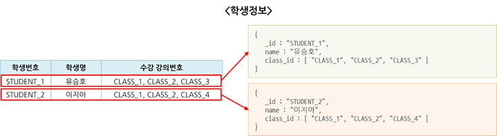

# mongoDB Data Modeling

## 1. mongoDB 데이터 모델링이란?
- 데이터 모델링은 업무 수행 시 발생하는 데이터를 정확하고 효율적으로 데이터베이스에 저장하기 위해 데이터 구조 설계하는 과정ㅇ이다.
- RDBMS 데이터 모델링이 테이블 설계 후 칼럼을 설계하는 순서로 진행된다면 몽고DB 는 도큐먼트 설계 후 컬렉션을 설계하는 순서로 진행된다.
- 어플리케이션 처리방안을 고려한 도큐먼트 구조를 어떻게 설계하느냐에 따라 데이터 정합성과 성능에 큰 영향을 준다.

## 2. 도큐먼트 구조란?

- 도큐먼트는 관계형 데이터베이스의 Row와 같은 개념이며, mongoDB에서는 데이터를 저장하는 최소 단위이다.
- 데이터 관계를 표현하는 방식에 따라 임베디드 방식과, 레퍼런스 방식으로 나뉜다.

### 2-1. 임베디드 방식 
- 관계를 갖는 데이터 집합을 단일 도큐먼트에 포함하여 저장하는 방식으로 엑셀에서 학생정보와 학생이 수강하는 강의 정보를 통합하여 1개의 시트로 관리하는 방식과 유사하다.  
  
- 임베디드 방식은 강의 정보 처럼 동일한 데이터를 각 학생 도큐먼트에 저장하여 구조를 단순화하는 반정규화 모델이다.
- 임베디드 방식은 조회 성능이 좋고 도큐먼트에 포함된 관련 데이터를 모두 업데이트 할 수 있다.
- 데이터 관리가 직관적이고 쿼리가 단순하다.

#### 문제점 
- 데이터 중복은 도큐먼트 구조를 단순화하고 조회 성능을 향상하나 데이터 불일치가 발생할 수 있다.
- 도큐먼트에 포함하는 데이터가 증가할수록 도큐먼트의 크기도 증가하여 디스크  I/O 시 성능 저하 발생 및 도큐먼트의 최대 크기 초과 시 저장이 불가능할 수 있다.
- 데이터 관계가 복잡하거나 계층 구조를 갖는 업무는 관리가 어렵다.

#### 권장 업무 
- 조회 성능이 중요하고 데이터 중복에 따른 데이터 불일치 문제가 발생하지 않는 업무 
- 업데이트가 과도하게 발생하지 않는 업무 

### 2-2. 레퍼런스 기본 방식 
- 도큐먼트에 관계를 갖는 다른 도큐먼트의 식별자를 참조키로 저장하여 필요시 애플리케이션에서 조인하는 방식으로 엑셀에서 학생 정보와 강의 정보를 2개의 개별 시트로 관리하며 필요시 참조하는 방식과 유사하다.  
    
  
- 레퍼런스 방식은 데이터가 중복되지 않도록 업무 성격별로 컬렉션을 분리 후 참조하므로 데이터 불일치가 발생하지 않는 정규화 모델이다.
- 적절한 업무 단위의 컬렉션으로 데이터가 분리되어 임베디드 방식 대비 도큐먼트의 크기 증가가 작다.
- 업무 요건 추가 및 변경으로 인한 도큐먼트 구조에 미치는 영향이 적다.

#### 문제점 
- 참조가 많은 도큐먼트 또는 대규모 도큐먼트를 조회하는 경우 애플리케이션에서 2차 쿼리로 인한 처리랴 증가로 조회 성능이 저하될 수 있다.
- 데이터 중복에 의한 데이터 일관성 문제는 해소되나 참조 정보를 정확하게 관리하지 않는 경우 참조 정보 소실에 의한 데이터 정합성 문제가 발생할 수 있다.

#### 권장 업무 
- 조회 성능 보다는 데이터 무결성이 중요한 업무
- 임베디드 방식으로 사용 시 디스크 I/O 성능에 문제가 예상되는 업무 
- 데이터의 관계가 복잡하거나 계층 구조를 갖는 업무 

### 2-3.. 레퍼런스 세부 방식 
- 관계를 갖는 도큐먼트들 중 참조키를 어떤 도큐먼트에 저장할 것인지에 따라 3가지 참조 방식으로 나뉜다.  
  

#### 자식 참조
- 부모 도큐먼트에서 관계를 갖는 자식 도큐먼트의 식별자를 참조키로 저장하는 방식이다.
- 부모 도큐먼트와 관계를 갖는 자식 도큐먼트를 쉽게 찾을 수 있으며 참조 정보가 부모 도큐먼트에만 존재하므로 관리가 편리하다.
- 부모 도큐먼트에 업데이트가 집중되어 성능 문제가 발생할 수 있으며 자식 도큐먼트가 많은 경우 도큐먼트의 최대 크기를 초과할 수 있다.
- 부모 도큐먼트에 발생하는 부하 및 크기 증가를 고려하여 자식 도큐먼트가 적게 생성되는 업무에 적합하다.

#### 부모 참조 
- 자식 도큐먼트에서 관계를 갖는 부모 도큐먼트의 식별자를 참조키로 저장하는 방식이다.
- 자식 도큐먼트에서 부모 도큐먼트를 쉽게 찾을 수 있으며 자식 도큐먼트의 추가 및 삭제로 인한 부모 도큐먼트의 업데이트가 없다.
- 부모 도큐먼트와 관계를 갖는 모든 자식 도큐먼트 주회 시 소요시간이 증가할 수 있다.
- 이력 또는 로그 데이터와 같이 자식 도큐먼트가 많이 생성되는 업무에 적합하다.

#### 상호 참조 
- 관계를 갖는 부모 도큐먼트와 자식 도큐먼트가 각각 서로의 식별자를 참조키로 저장하는 방식이다.
- 부모 도큐먼트에서 자식 도큐먼트를 찾거나 자식 도큐먼트에서 부모 도큐먼트를 쉽게 찾을 수 있으나 다른 방식에 비해 참조 정보 관리가 어렵다.
- 부모 도큐먼트와 자식 도큐먼트 모두 업데이트가 과도하게 발생할 수 있으며 참조 정보 관리 부주의 시 데이터 정합성 문제가 발생할 수 있다.
- 데이터 변경이 적고 부모 도큐먼트와 자식 도큐먼트가 서로를 빈번하게 참조하는 업무에 적합하다.

## 3. 컬렉션 
- 컬렉션은 관계형 데이터 베이스의 Table 과 같은 개념으로 용도가 같거나 유사한 도큐먼트들의 그룹을 묶는 단위를 의미한다. 

#### 일반 컬렉션
- 가장 일반적으로 사용되는 컬렉션이다.

#### 캡드 컬렉션
- 고정된 크기를 갖는 컬렉션으로 높은 성능의 로깅 기능을 위해 설계된다.
- 도큐먼트 추가 시 디스크 공간이 없느 ㄴ경우 가장 오래전에 추가된 도큐먼트부터 덮어쓰기 한다.
- 오래된 데이터를 수동으로 삭제하는 작업을 없애 데이터 관리가 편리하다.
- 로깅을 위해 만들어져 사용자가 임의로 삭제하거나 업데이트할 수 없다.

#### TTL 컬렉션 
- 특정 시간이 경과한 도큐먼트를 자동으로 삭제하는 컬렉션으로 TTL 인덱스에 의해 지원되는 기능이다.
- "_id" 필드 또는 이미 다른 인덱스가 있는 필드는 TTL 인덱스를 가질 수 없다.
- 캡드 컬렉션인 경우 TTL 인덱스를 가질 수 없다.
- 단일 인덱스만 사용 가능하며 복합 인덱스를 가질 수 없다.

#### 시스템 컬렉션
- mongoDB 내부에서 사용되는 컬렉션으로 사용자가 지정하여 사용할 수 없ㄷ.

## 4. 데이터 모델링 절차 

- 요구사항 수집: 사용자가 시스템에서 요구하는 정보를 수집한다.
- 업무 데이터 분석: 업무 데이터의 발생 규칙과 관계 및 서비스에 대한 정보를 분석한다.
- 도큐먼트 설계: 분석된 업무 데이터를 기반으로 애플리케이션의 처리 방안과 읽기 및 업데이트 성능 등을 고려하여 도큐먼트를 설계한다.
- 컬렉션 설계: 컬렉션명 부여 및 적절한 컬렉션 종류를 선택한다.

## 5. 데이터 모델링 고려사항 
#### 명명 규칙
- 관계자 간 의사소통 및 명확한 데이터 관리를 위해 컬렉션명 및 필드명에 대한 명명 규칙이 필요하다.
- 합의되지 않은 약어의 사용은 의미가 불명확하여 의미 전달이 어렵다.
- 필드명은 데이터 크기에 포함되므로 명확한 의사전달이 가능한 수준의 적절한 명칭을 부여해야 한다.

#### 필드명 
- 필드명도 크기를 갖는 데이이터이며 아래 예씨는 character set에 따라 다를 수 있다.  
  

#### 도큐먼트 중첩 
- 도큐먼트 중첩은 도큐먼트 내부에 존재하는 도큐먼트를 의미하며 최대 100 레벨까지 가능하다.
- 관계를 갖는 데이터를 단일 도큐먼트에 저장할 수 있으나 도큐먼트의 크기를 증가시켜 디스크 I/O 성능 저하 및 도큐먼트 최대 크기를 초과할 수 있어 사용에 주의가 필요하다.  
  

#### 도큐먼트 크기 
- 도큐먼트의 최대 크기는  16 MByte 이며, 최대 크기 이하로 도큐먼트를 관리해야 한다.
- 도큐먼트 크기가 최대 크기를 초과하는 경우 컬렉션 분리를 고려해야 하며 다음의 예시는 업무 특성에 맞춰 도큐먼트를 분리한 예시이다.  
  

#### 컬렉션 분리 
- 단일 컬렉션에 쓰기 작업이 ㅁ낳은 경우 컬렉션 분리를 고려한다.
- 단일 컬렉션에서 대량의 데이터를 정기적으로 삭제하는 경우 컬렉션 분리를 고려한다.
- 단일 컬렉션에 저장되는 도큐먼드들의 액세스 패턴이 다양한 경우 컬렉션 분리를 고려한다.
- 자주 조회되거나 도큐먼트 수가 적은 컬렉션은 메모리에 캐시 될 수 있도록 컬렉션 분리를 고려한다.
